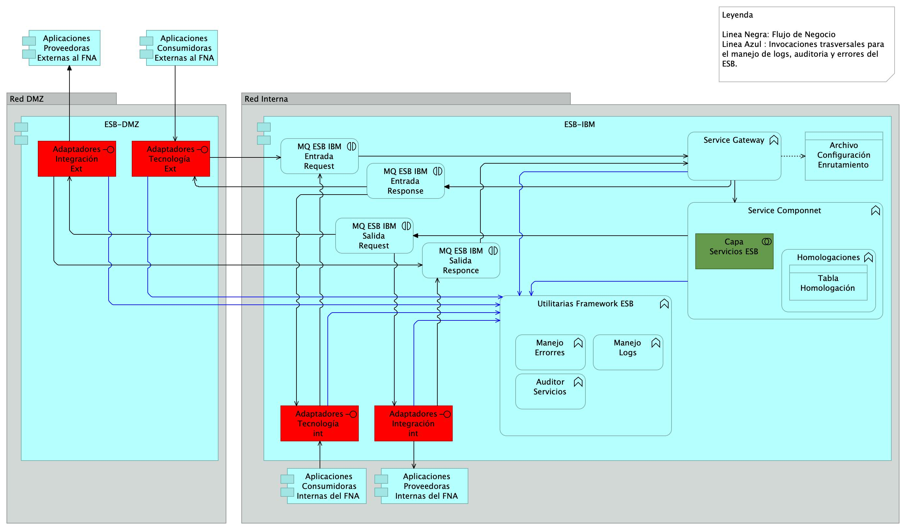

|Tema            |Portafolio de iniciativas y brechas: **Matriz de brechas de arquitectura SOA candidata del segmento FNA**|
|----------------|---------------------------------------------------|
|Palabras clave  |SOA, Análisis de brecha, GAP, Comparativa          |
|Autor           |                                                   |
|Fuente          |                                                   |
|Version|$COMMIT del $FECHA_COMPILACION                              |
|Vínculos|[N003a Vista Segmento SOA FNA](N03a%a20Vsta%20aSegenta%20SOA%20FNA.md)|

 

## Matriz de brechas de arquitectura SOA candidata del segmento FNA
Los análisis siguientes corresponden a la descripción de los elementos de cierre de brechas del FNA _respecto al contexto de flexibilidad de negocio_. Es decir, los cambios analizados abajo están asociados al contexto de flexibilidad de negocio, y por tanto, aportan a este, y por ende, a la empresa FNA. Dicho de otra manera, las brechas descritos a continuación son necesarios para mejorar la flexibilidad de negocio del segmento de empresa FNA objeto de este diagnóstico.

 

## Análisis de Brecha Crédito Constructor. Contexto Flexibilidad de Negocio

[Imagen 1.]() Partes de la arquitectura de Crédito Constructor impactados por el análisis de brecha en el contexto de flexibilidad de negocio.

_Fuente: ae_fna_as_is.archimate._

 

Las partes impactadas por el análisis de brecha de la arquitectura de Crédito Constructor en el contexto de flexibilidad de negocio, y que por razón de este deben ser sustituidas por API indicadas en la arquitectura de SOA 2.0 del FNA son los indicados con actualización en la siguiente tabla. 

| **nombre**                              | **tipo**                  | **brecha**    |
|-----------------------------------------|---------------------------|---------------|
| ESB-IBM                                 | application-component     |               |
| Adaptador Integración Cobis             | application-component     | sustitución   |
| FrameWork ESB                           | application-collaboration |               |
| Adaptador Tecnologia SOAP               | application-component     | sustitución   |
| Adaptador Integración Bizagi IBM (java) | application-component     | sustitución   |
| Adaptador Integración Cuadro de ventas  | application-component     | sustitución   |
| Cobis                                   | application-component     | actualizacion |
| Servicios Cobis                         | application-service       |               |
| Cuadro Ventas CCP                       | application-component     | actualizacion |
| Servicios Cuadro de Ventas CCP          | application-service       |               |
| Bizagi IBM (java)                       | application-component     | actualizacion |
| Servicios CapaSoa Bizagi                | application-service       |

 

## Análisis de Brecha Bus de Datos Empresarial. Contexto Flexibilidad de Negocio
Siguiendo la misma intención de introducir las API (arquitectura candidata SOA, 2.0 del FNA) para aumentar la flexibilidad de negocio, esta vez, en el bus de datos de la empresa, este debe transicionar de adaptadores particulares a API estándares de nivel funcional. Nota: el cambio de adaptadores por API implica, y puede que con mayor profundidad, a los consumidores de estos adaptadores.

[Imagen 1.]() Partes de la arquitectura del bus de datos del FNA (ESB IBM) impactados por el análisis de brecha en el contexto de flexibilidad de negocio.

_Fuente: ae_fna_as_is.archimate._

 

Las partes impactadas por el análisis de brecha de la arquitectura del bus de datos del FNA (ESB IBM) en el contexto de flexibilidad de negocio, y que por razón de este deben ser intervenidas por API, quereridas en la arquitectura SOA 2.0 del Fondo, son los indicados en la siguiente tabla, columna 'brecha'. 

| **nombre**                                      | **tipo**                  | **brecha**    |
|-------------------------------------------------|---------------------------|---------------|
| ESB-IBM                                         | application-component     |               |
| MQ ESB IBM Entrada Request                      | application-interaction   |               |
| Service Gateway                                 | application-function      |               |
| Adaptadores IntegraciÛn int                     | application-interface     | sustitución   |
| Archivo ConfiguraciÛn Enrutamiento              | data-object               |               |
| Service Componnet                               | application-function      |               |
| Homologaciones                                  | application-function      |               |
| Tabla HomologaciÛn                              | data-object               |               |
| Capa Servicios ESB                              | application-collaboration | actualización |
| Adaptadores TecnologÌa  int                     | application-interface     | sustitución   |
| Utilitarias Framework ESB                       | application-function      |               |
| Manejo Logs                                     | application-function      |               |
| Manejo Errorres                                 | application-function      |               |
| Auditor Servicios                               | application-function      |               |
| MQ ESB IBM Salida Request                       | application-interaction   |               |
| MQ ESB IBM Entrada Response                     | application-interaction   |               |
| MQ ESB IBM Salida Responce                      | application-interaction   |               |
| Aplicaciones Proveedoras Internas del FNA       | application-component     |               |
| Aplicaciones Consumidoras Internas del FNA      | application-component     |               |
| ESB-DMZ                                         | application-component     |               |
| Adaptadores IntegraciÛn Ext                     | application-interface     | sustitución   |
| Adaptadores TecnologÌa  Ext                     | application-interface     | sustitución   |
| Aplicaciones Consumidoras Externas al FNA       | application-component     |               |
| Aplicaciones Proveedoras Externas al FNA (copy) | application-component     |

 

