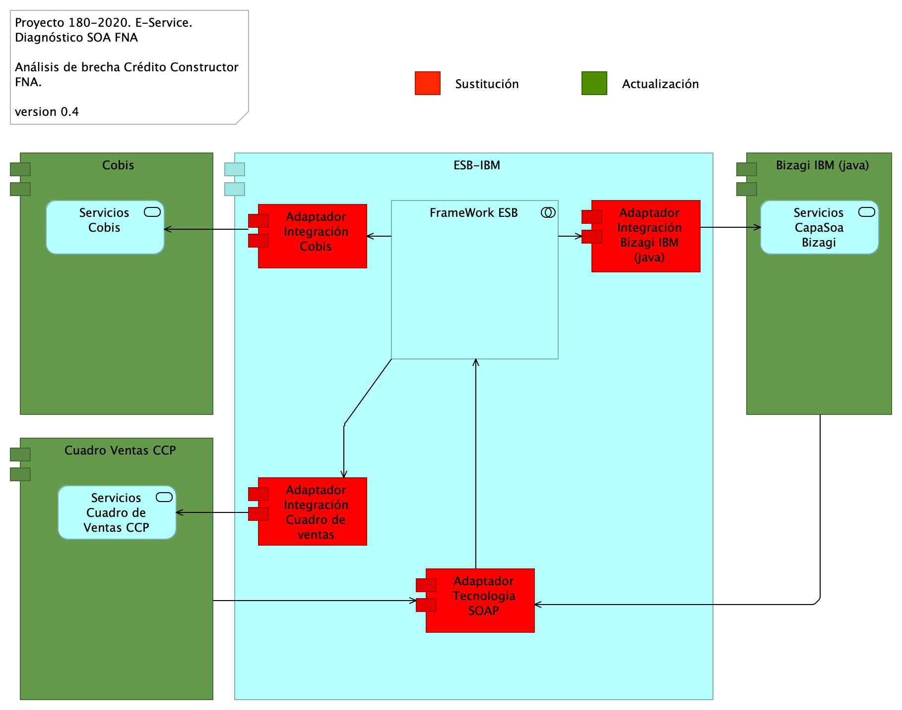

|Tema            |Portafolio de iniciativas y brechas: **Matriz de brechas de arquitectura SOA candidata del segmento FNA**|
|----------------|---------------------------------------------------|
|Palabras clave  |SOA, Análisis de brecha, GAP, Comparativa          |
|Autor           |                                                   |
|Fuente          |                                                   |
|Version|$COMMIT del $FECHA_COMPILACION                              |
|Vínculos|[N003a Vista Segmento SOA FNA](N03a%a20Vsta%20aSegenta%20SOA%20FNA.md)|

 

## Matriz de brechas de arquitectura SOA candidata del segmento FNA
Los análisis siguientes corresponden a la descripción de los elementos de cierre de brechas del FNA _respecto al contexto de flexibilidad de negocio_. Es decir, los cambios analizados abajo están asociados al contexto de flexibilidad de negocio, y por tanto, aportan a este, y por ende, a la empresa FNA. Dicho de otra manera, las brechas descritos a continuación son necesarios para mejorar la flexibilidad de negocio del segmento de empresa FNA objeto de este diagnóstico.

 

## Análisis de Brecha Crédito Constructor. Contexto Flexibilidad de Negocio

[Imagen 1.]() Partes de la arquitectura de Crédito Constructor impactados por el análisis de brecha en el contexto de flexibilidad de negocio.

_Fuente: ae_fna_as_is.archimate._

 

Las partes impactadas por el análisis de brecha en el contexto de flexibilidad de negocio que deben ser sustituidas por API indicadas en la arquitectura de SOA 2.0 del FNA para el caso de Crédito Constructor son los indicados con actualización en la siguiente tabla. 

| **nombre**                              | **tipo**                  | **brecha**    |
|-----------------------------------------|---------------------------|---------------|
| ESB-IBM                                 | application-component     |               |
| Adaptador Integración Cobis             | application-component     | sustitución   |
| FrameWork ESB                           | application-collaboration |               |
| Adaptador Tecnologia SOAP               | application-component     | sustitución   |
| Adaptador Integración Bizagi IBM (java) | application-component     | sustitución   |
| Adaptador Integración Cuadro de ventas  | application-component     | sustitución   |
| Cobis                                   | application-component     | actualizacion |
| Servicios Cobis                         | application-service       |               |
| Cuadro Ventas CCP                       | application-component     | actualizacion |
| Servicios Cuadro de Ventas CCP          | application-service       |               |
| Bizagi IBM (java)                       | application-component     | actualizacion |
| Servicios CapaSoa Bizagi                | application-service       |

