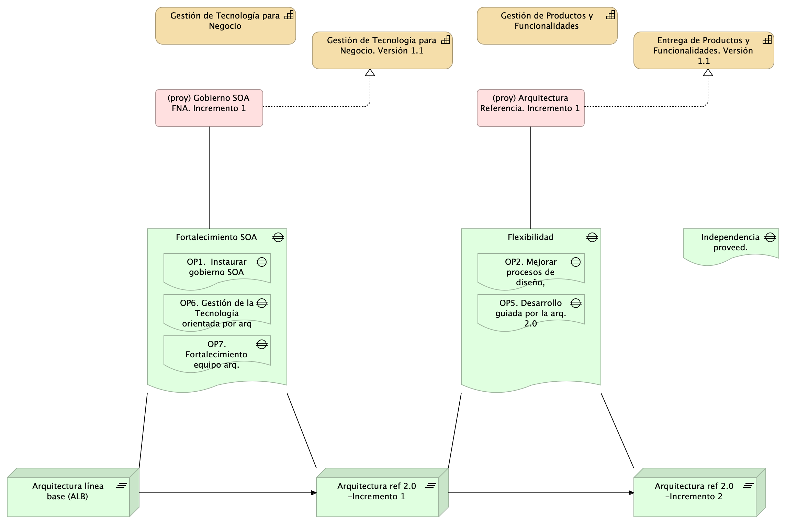
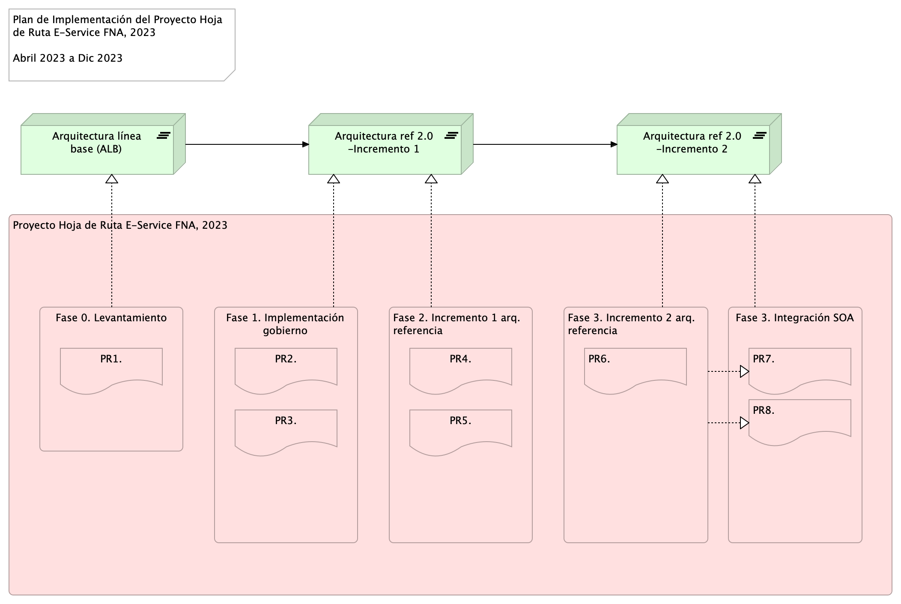

|Tema            |Portafolio de iniciativas y brechas: **Hoja de ruta de los proyectos de cambio**|
|----------------|---------------------------------------------------|
|Palabras clave  |SOA, Análisis de brecha, GAP, Comparativa          |
|Autor           |                                                   |
|Fuente          |                                                   |
|Version|$COMMIT del $FECHA_COMPILACION                              |
|Vínculos|[N003a Vista Segmento SOA FNA](N03a%a20Vsta%20aSegenta%20SOA%20FNA.md)|

 

## Hoja de Ruta E-Service FNA de los Proyectos de Cambio

[Imagen 1.]() Proyectos de cierre de brecha FNA. Prioridades, dependencias, secuencia, puntos de control de la evolución de la arquitectura de referencia SOA 2.0 del Fondo.

_Fuente: elaboración propia._

Asunto
La ejecución de la hoja de ruta E-Service (diagnóstico SOA) plantea la implementación de los proyectos de cierre de brechas que impacten a los problemas diagnosticados en dicho proyecto. Estos son: a la flexibilidad de negocio, al fortalecimiento de construcción y diseño de servicios, y a la independencia de proveedor, en el ámbito de las vicepresidencias de Crédito y de Operación, en el período de ejecución 2023.

Como resultado del inicio de la ejecución de la hoja de ruta el Fondo Nacional del Ahorro (FNA) procura 1) aumentar las capacidades de desarrollo de soluciones y requerimientos, y 2) modernizar y aumentar la capacidad del uso tecnológico de estas soluciones.

Puntualmente, la implementación (todos los proyectos) de la hoja de ruta, tal como está diagnosticada por E-Service, buscan los objetivos de:

	• Flexibilidad y tiempo de mercado (OBJ3)
	• Fortaleza SOA de las aplicaciones (OBJ2)
	• Independencia de proveedor (OBJ1)
	
Para lo cual, la hoja de ruta E-Service está orientada a impactar los siguientes brechas y oportunidades:
	• OP1. Instaurar la figura de gobierno SOA, capacidad, proceso y recursos
	• OP2. Mejorar proceso de diseño,  construcción y DevOps de soluciones SOA
	• OP3. Mejorar la oferta de servicios analíticos en segmento FNA
	• OP4. Aumentar el nivel de utilización de la Tecnología SOA del FNA
	• OP5. Desarrollo de Servicios FNA guiada por la arquitectura de referencia 2.0
	• OP6. Gestión de la Tecnología (gobierno) orientada por arquitectura 2.0
	• OP7. Articulación y fortalecimiento del equipo de arquitectura del FNA junto a proveedores
	• OP8. Monitoreo de los índices de eficacia de los servicios FNA

Alcance 
Para el período 2023, la implementación de la hoja de ruta E-Service impactará los objetivos de Flexibilidad (OBJ3) y Fortalecimiento (OBJ2), mediante el incremento de las capacidades del FNA de diseño e implementación de soluciones de negocio (ver todas las capacidades FNA, diagnóstico E-Service, fase 1), en el dominio de aplicaciones y servicios solamente. 

Las capacidades impactadas en el alcance del proyecto hoja de ruta E-Service, período 2023, para el dominio de aplicaciones y servicios 
	• CAP1. Capacidad de gestión de tecnología
	• CAP2. Entrega de productos y funcionalidades.

El incremento de las capacidades de gestión de tecnología (TI), y la de entrega de productos y funcionalidades, incluidas en el alcance del período 2023, se realizará mediante la ejecución de los proyectos aquí indicados:

	1. (proy. cierre brecha) PRY01. Gobierno SOA FNA --Incremento 1: dominio de aplicaciones y servicios únicamente
	2. (proy. cierre brecha) Arquitectura Referencia --Incremento 1: dominio de aplicaciones y servicios únicamente

El alcance del proyecto de ejecución de la hoja de ruta, período 2023, es el ilustrado en la imagen siguente.

[Imagen 1.]() Vista de evolución de capacidades dentro del alcance del proyecto hoja de ruta E-Service, período 2023, dominio de aplicaciones y servicios. Capacidades incrementadas para impactar a los objetivos Flexibilidad (OBJ3) y Fortalecimiento (OBJ2).

Por consecuencia de estos los proyectos PRY01 y PRY02 de la hoja de ruta, en el período 2023, y del consiguiente incremento en las capacidades del FNA incluidas en este alcance, la arquitectura SOA del Fondo evolucionará a su vez en dos versiones nuevas, como sigue

[Imagen 2.]() Vista de evolución de arquitectura de referencia FNA a razón del las capacidades incrementadas.

Componentes modificados
Los aumentos de versión de la arquitectura SOA del FNA implica que ítems de trabajo, componentes de software, aplicaciones, tecnologías o recursos de capital humano deban ser modificados (aumentado de versión).

Con propósito únicamente ilustrativo de los ítems que pueden ser sujetos de variante (especialización) por concepto de los incrementos de la arquitectura del FNA, dominio de aplicaciones y servicios únicamente, bajo las condiciones de tiempo y recursos del proyecto de implemenatción de hoja de ruta E-Service, período 2023, presentamos a continuación una lista de aplicaciones de software que pueden llegar a cambiar (otros ítems se no presentes en este ejemplo pueden ser impactados).

[Imagen 2.]() Aplicaciones de software del FNA involucrados en los incrementos de versión de la arquitectura de referencia.

Equipo de Trabajo
Por proyecto.

PRY01. Gobierno SOA FNA --Incremento 1: dominio de aplicaciones y servicios
	• Director / Gerente proyecto (Stefanini)
Nota: este recurso puede ser individual, o común entre ambos proyectos del alcance

	• Especialista SOA 1, o Arquitectura empresarial (Stefanini)
	• Especialista construcción software, servicios y componentes (Stefanini)
	• Personal del FNA
		○ Especialista SOA
		○ Especialista(s) construcción software
	
PRY02. Arquitectura Referencia --Incremento 1: dominio de aplicaciones y servicios
	• Director / Gerente proyecto (Stefanini)
Nota: este recurso puede ser individual, o común entre ambos proyectos del alcance

	• Especialista SOA o Arquitectura de software (Stefanini)
	• Especialista construcción software, servicios y componentes (Stefanini)
	• Personal del FNA
		○ Especialistas de aplicaciones pertenecientes al incremento de versión de la arquitectura FNA (ver Figura3. Aplicaciones de software del FNA involucrados en los incrementos de versión de la arquitectura de referencia)
		○ Líder funcional de aplicaciones pertenecientes al incremento de versión de la arquitectura FNA

Plan de Trabajo

[Imagen 4.]() Plan de Implementación del Proyecto Hoja de Ruta E-Service FNA, 2023. Abril 2023 a Dic 2023. Ver 1.0

Costo Beneficio (aproximado)
…
Consideraciones
…
