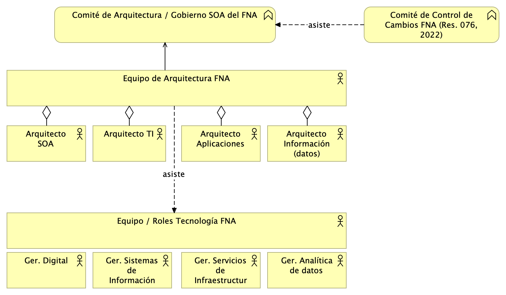
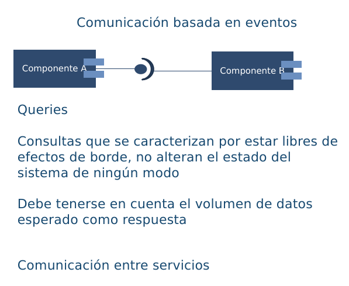
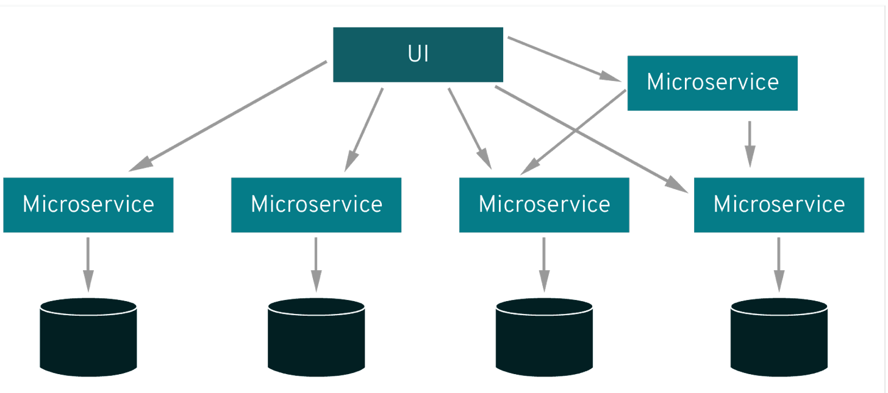
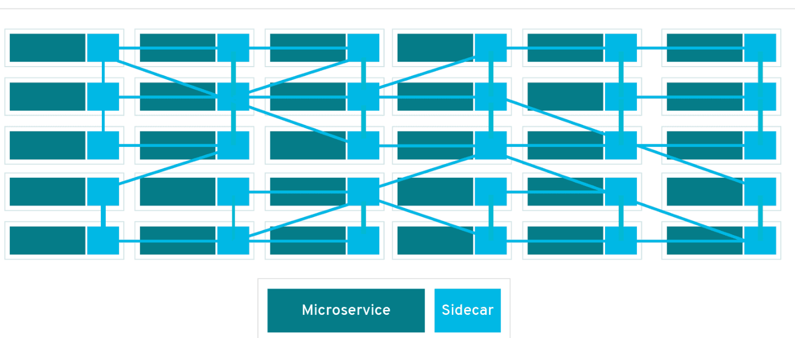

|Tema            |Portafolio de iniciativas y brechas: **Plan de comisionamiento e implementación de Infraestrutura**|
|----------------|---------------------------------------------------|
|Palabras clave  |SOA, Proyecto de cierre brecha, Brecha, Infraestructura |
|Autor           |                                                   |
|Fuente          |                                                   |
|Version|$COMMIT del $FECHA_COMPILACION                              |
|Vínculos|[N003a Vista Segmento SOA FNA](N03a%a20Vsta%20aSegenta%20SOA%20FNA.md)|

 

## Plan de Comisionamiento e Implementación de Infraestrutura
A partir de la comparativa de la industria (ver Fase 2, [05a. Comparativa FNA industria](N03a%a20Vsta%20aSegenta%20SOA%20FNA.md)), y de otros diagnósticos de fases anterior de este ejercicio, como el dominio de infraestructura ([08c. Dominio de infraestructura](N03a%a20Vsta%20aSegenta%20SOA%20FNA.md)) de la arquitectura de referencia ([08a. Arquitectura-referencia-v2](N03a%a20Vsta%20aSegenta%20SOA%20FNA.md)), la vigilancia y avances de la industria ([07b. Vigilancia avances de la industria](N03a%a20Vsta%20aSegenta%20SOA%20FNA.md)), encontramos los siguientes proyectos de infraestructura a incluir en el plan de comisionamiento o adquisición de tecnología del FNA.

Conjugando todos los diagnósticos indicados, listamos los proyectos de adquisición y/o montaje de infraestructura requeridos para el plan de comisionamiento o adquisición tecnológica del FNA.

### Arquitectura SOA
Adquisición de licencias de la herramienta de modelado de arquitectura y de herramientas adicionales de modelado de arquitecturas de servicios, como Integration Designer de IBM, licencias de ejecución y programación de modelos Archimate.

 

### Gobierno SOA
Adicional a la infraestructura de software relacionado con el Gobierno SOA, el FNA debe considerar en su plan de adquisición de tecnología e infraestructura las indicadas a continuación: 
(Arquitectura de referencia SOA) servidores de aplicación y funciones de nube sin servidor para implementar la mejora de servicios SOA incorporada en la arquitectura de referencia 2.0 (_service mesh_), servidores o servicios de aplicación para la implementación de GraphQL, y una subscripción individual adicional con el proveedor de nube (CSP) adjudicado al FNA. Sumamos a estas adquisiciones de infraestrctura otras de índole operativa, pero complementarias, e igualmente necesarias. Se tratan de las herramienta y licencias de documentación y generación de contenido técnico, como manuales, procedimientos, lecciones, configuración de componentes, entre otros.

Como un apéndice del plan de adquisición que estamos recomendando al FNA, se encuentran la contratación de los recursos de capital humano que entran en la operación del gobierno SOA. Sin bien, esto no es infraestructura, sí son recursos que la operan. El equipo de trabajo requerido conforme el modelo de gobierno SOA presentado aquí se compone del capital humano en los roles de gestión de la tecnología y arquitectura en los ámbitos de diseño de servicios SOA y componentes de software, infraestructura tecnológica y redes, aplicaciones de solución y herramientas de software, y del especialista de las estructuras de datos e información del negocio. 

[Imagen 2.]() Roles y Grupos de trabajo del gobierno SOA del FNA.

_Fuente: elaboración propia._

 

### Estrategia de Versionamiento
Los proyectos de adquisición tecnológicas que relacionaremos aquí para el manejo de versión tienen que ver únicamente con el versionamiento de los servicios y API, que son los componentes activos hacia los que apunta la arquitectura de referencia SOA 2.0 diagnosticada por este ejercicio. En este sentido, tenemos: para el manejo de la gestión del cambio se requiere la adquisición de los equipos y licencias de un API Gateway (el que la entidad elija pero compatible con la arquitectura 2.0), junto con los equipos para la ejecución de las Herramientas de documentación y gestión de las versiones de servicios, como Swagger, MadCap Flare, y OpenAPI.

 

### Monitoreo y Operación
La adquisición tecnológica que el FNA debe hacer para cumplir con este punto, _que está relaciondo con DevOps_, es la siguiente: herramienta adicional para gestionar el despliegue y operación de los servicios, como GitLAB CI, Azure DevOps (recomendado si el CSP es Microsoft), TeamCity de JetBrains, o Bamboo de Atlassian. 

Como segunda adquisición, ahora respecto a la gestión de contenedores, es requerido las licencias (plan) de gestión de Kubernetes, como Kubecost. 

En un tercer nivel de adquisición se encuentran las herramientas para monitoreo de la operación, gestión de alarmas y notificaciones y consumo de infraestructura que complemente a las actuales del FNA, y que sean compatibles con la arquitectura de referencia SOA 2.0. Para este efecto, y de manera puntual, estamos recomendando New Relic, por las capacidades de monitoreo del rendimiento de aplicaciones, de la observabilidad, y de la infraestructura.

 

## Detalles de Implementación de Infraestrutura
A manera de detalle de lo que implican los proyectos del plan de comisionamiento o adquisición tecnológica del FNA delineado arriba, presentamos las vista de información de componentes e infraestructura de las soluciones relacionadas en dichos proyectos. 

### Arquitecturas Orientadas a Eventos

Sin duda alguna el mecanismo de comunicación más utilizado en
arquitectura orientadas a componentes y servicios es el mecanismo
conocido como request-reply. Es decir, comunicaciones basadas en
transferencia sincrónica de información. Este mecanismo implica en
general, la comunicación entre un servicio consumidor y un servicio
proveedor. El servicio consumidor, debe inicialmente localizar al
servicio consumidor (posiblemente con ayuda de un ESB) y ejecutar una
petición al servicio proveedor. A través de protocolos como SOAP la
comunicación se establece y el intercambio de información comienza
(posiblemente en datos usando formatos en XML).

En el esquema de comunicación basado en mensajes tres son los conceptos de
suma importancia: Eventos, Queries y Comandos.

Los eventos, en una Arquitectura orientada por eventos (EDA) representan
hechos cumplidos, que desean ser notificados de manera asíncrona a los
demás servicios participantes de una solución.

{width="3.466666666666667in"
height="2.8958333333333335in"}

Las consultas, representan peticiones a un servicio, que no tienen
efecto de borde.

{width="3.738888888888889in"
height="3.0625in"}

 

Los comandos, representan una intención de cambio en el estado de la
solución. Los comandos son solicitudes que pueden o no ejecutarse, no se
tiene certeza de su cumplimiento. En cualquier caso, el resultado de
ejecución de un comando, puede tener como resultado un evento
notificando a los interesados el resultado obtenido.

{width="4.132638888888889in" height="3.0131944444444443in"}

 

{width="2.9868055555555557in"
height="2.558333333333333in"}

 

La figura anterior, muestra el esquema de comunicación fundamental en
las arquitecturas orientadas a eventos. Para ver los detalles completos de este proyecto que por este estudio hemos consignado, ver [...](N03a%a20Vsta%20aSegenta%20SOA%20FNA.md))

 

### Service Mesh

En los esquemas de comunicación sincrónica, donde los servicios
localizan otros servicios y envían peticiones sincrónicas (conteniendo
comandos o consultas). Uno de los problemas que pueden surgir, tienen
que ver con la necesidad de satisfacer diferentes requisitos de calidad,
como la seguridad, la disponibilidad y la escalabilidad. Varias de esos
requisitos se resuelven con diferentes componentes, como, por ejemplo,
los balanceadores de carga, herramientas de replicación y de
autorización y autenticación. Adicionalmente, cada servicio implementa
en su lógica, ciertas funcionalidades para manejar este tipo de
requisitos, haciendo la complejidad y el mantenimiento de las
aplicaciones más complejo. Este escenario se ilustra en la siguiente
figura.

{width="2.9808464566929134in"
height="1.3225918635170604in"}

Tomado de:
https://www.redhat.com/en/topics/microservices/what-is-a-service-mesh

 

En un esquema service mesh, cada servicio es acompañado de un proxy
(llamado sidecar), este proxy se encarga de gestionar toda la seguridad,
disponibilidad y escalabilidad, de forma que los servicios no tengan que
preocuparse por estos elementos. La siguiente figura ilustra esta idea.

{width="3.053390201224847in"
height="1.29834208223972in"}

Tomado de:
https://www.redhat.com/en/topics/microservices/what-is-a-service-mesh

 

La siguiente figura resume lo antes expuesto, donde además se ilustran
los dos elementos fundamentales de este esquema: data plane y control
plane.

El término data plane, se refiere a los proxies (sidecars) asociados a
cada microservicio. El control plane se encarga de gobernar los proxies
asociados a los microservicios.

{width="4.0495778652668415in"
height="1.748759842519685in"}

Tomado de:
https://www.techtarget.com/searchitoperations/definition/service-mesh

 

### Plataforma de Integración Híbrida (HIP)

Sin duda alguna tanto las tecnologías basadas en APIs y consumos de
servicios síncronos han sido y seguirán siendo pieza clave en las
arquitecturas de integración y orquestación de servicios. Las
organizaciones han realizado inversiones altas en la instalación y
mantenimiento de infraestructura como ESBs sin contar las múltiples
soluciones que hoy día se manejan basadas en este esquema de
comunicación.

De otra parte, los mecanismos de sincronización y comunicación
asíncronos, basados primordialmente en colas de mensajes, se vienen
posicionando como una alternativa cada vez más seria a los buses de
servicios tradicionales.

Las plataformas de integración híbridas (HIP) se posicionan cada vez más
como una forma de conciliar las estrategias de integración tradicionales
y las nuevas tendencias orientadas a eventos. Estas plataformas
propenden por la transferencia de estado entre sistema de información
utilizando las plataformas de mensajería y la consulta de información de
forma sincrónica sobre copias con ventanas de consistencia (consistencia
eventual)

{width="4.3313156167979in"
height="3.0198906386701663in"}

 

### Hub de Integración Digital (DIH)
Un DIH es un estilo de arquitectura que busca desacoplar sistemas de
información en un ecosistema de TI. No solo a nivel de flujo de control
sino también a nivel de datos, adicionando una capa de datos de muy baja
latencia. Adicionalmente se propone una mezcla de los tipos de
conectores expuestos anteriormente. En primer lugar, se cuenta con un
API de desacoplamiento. Los DIH permiten trabajar en esquemas híbridos,
con despliegues on-premises y despliegues en cloud.

{width="4.072457349081365in"
height="3.013879046369204in"}

Tomado de: https://www.gigaspaces.com/blog/digital-integration-hub-dih/

 

Esta arquitectura permite la práctica de técnicas DevOps, como la
integración y despliegue continuo. Adicionalmente, esta arquitectura se
enfoca en la recolección de datos desde múltiples fuentes de datos.

En las siguiente figuras podemos apreciar la comparación realizada en el
informe original de Gartner, entre una arquitectura tradicional basada
en APIS en la primera figura y una arquitectura basada en DIH en la
segunda figura.

{width="3.864676290463692in"
height="2.424093394575678in"}

Tomado de:
https://mindovermessaging.com/2022/03/29/maximising-your-apis-with-a-digital-integration-hub/

{width="3.8965157480314963in"
height="2.9486122047244097in"}

Tomado de:
https://mindovermessaging.com/2022/03/29/maximising-your-apis-with-a-digital-integration-hub/

En el esquema basado en DIH la diferencia fundamental radica en una
nueva capa ubicada entre el API Gateway y los microservicios y la
plataforma híbrida de integración. Esta capa denominada High Performance
Data Store (HPDS). Esta capa se alimenta a partir de la plataforma de
integración, usualmente utilizando un esquema basado en eventos.
