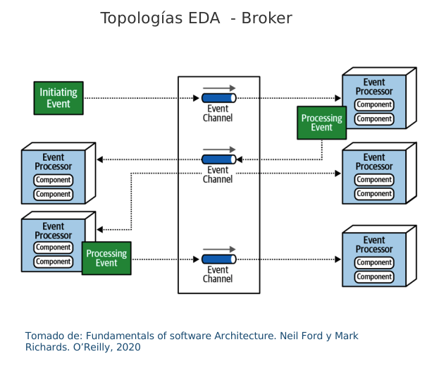
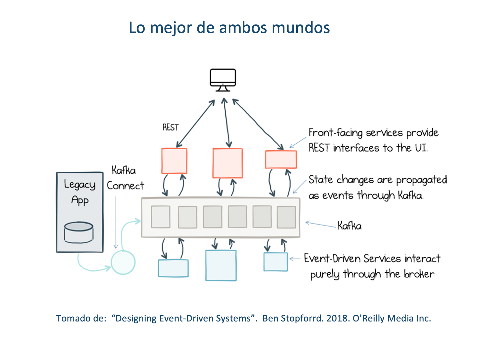

---
title: Diagnóstico SOA Actual FNA
keywords:
- SOA
- madurez
- gobierno
lang: en-US
date-meta: '2023-03-21'
author-meta:
- Harry Wong, ing.
- Eddie Hernandez, ing.
- Federico Suárez, ing.
- Darío Correal, ing.
header-includes: |
  <!--
  Manubot generated metadata rendered from header-includes-template.html.
  Suggest improvements at https://github.com/manubot/manubot/blob/main/manubot/process/header-includes-template.html
  -->
  <meta name="dc.format" content="text/html" />
  <meta property="og:type" content="article" />
  <meta name="dc.title" content="Diagnóstico SOA Actual FNA" />
  <meta name="citation_title" content="Diagnóstico SOA Actual FNA" />
  <meta property="og:title" content="Diagnóstico SOA Actual FNA" />
  <meta property="twitter:title" content="Diagnóstico SOA Actual FNA" />
  <meta name="dc.date" content="2023-03-21" />
  <meta name="citation_publication_date" content="2023-03-21" />
  <meta property="article:published_time" content="2023-03-21" />
  <meta name="dc.modified" content="2023-03-21T16:39:17+00:00" />
  <meta property="article:modified_time" content="2023-03-21T16:39:17+00:00" />
  <meta name="dc.language" content="en-US" />
  <meta name="citation_language" content="en-US" />
  <meta name="dc.relation.ispartof" content="Manubot" />
  <meta name="dc.publisher" content="Manubot" />
  <meta name="citation_journal_title" content="Manubot" />
  <meta name="citation_technical_report_institution" content="Manubot" />
  <meta name="citation_author" content="Harry Wong, ing." />
  <meta name="citation_author_institution" content="Arquitecto SOA, Stefanini" />
  <meta name="citation_author" content="Eddie Hernandez, ing." />
  <meta name="citation_author_institution" content="Datos, Stefanini" />
  <meta name="citation_author" content="Federico Suárez, ing." />
  <meta name="citation_author_institution" content="Infraestructura, Stefanini" />
  <meta name="citation_author" content="Darío Correal, ing." />
  <meta name="citation_author_institution" content="Arquitecto TI, Stefanini" />
  <link rel="canonical" href="https://hwong23.github.io/fna-devdoc-f3/" />
  <meta property="og:url" content="https://hwong23.github.io/fna-devdoc-f3/" />
  <meta property="twitter:url" content="https://hwong23.github.io/fna-devdoc-f3/" />
  <meta name="citation_fulltext_html_url" content="https://hwong23.github.io/fna-devdoc-f3/" />
  <meta name="citation_pdf_url" content="https://hwong23.github.io/fna-devdoc-f3/manuscript.pdf" />
  <link rel="alternate" type="application/pdf" href="https://hwong23.github.io/fna-devdoc-f3/manuscript.pdf" />
  <link rel="alternate" type="text/html" href="https://hwong23.github.io/fna-devdoc-f3/v/00de529ea9bddebf44037bb899fb389ae4f6ec82/" />
  <meta name="manubot_html_url_versioned" content="https://hwong23.github.io/fna-devdoc-f3/v/00de529ea9bddebf44037bb899fb389ae4f6ec82/" />
  <meta name="manubot_pdf_url_versioned" content="https://hwong23.github.io/fna-devdoc-f3/v/00de529ea9bddebf44037bb899fb389ae4f6ec82/manuscript.pdf" />
  <meta property="og:type" content="article" />
  <meta property="twitter:card" content="summary_large_image" />
  <link rel="icon" type="image/png" sizes="192x192" href="https://manubot.org/favicon-192x192.png" />
  <link rel="mask-icon" href="https://manubot.org/safari-pinned-tab.svg" color="#ad1457" />
  <meta name="theme-color" content="#ad1457" />
  <!-- end Manubot generated metadata -->
bibliography:
- content/manual-references.json
manubot-output-bibliography: output/references.json
manubot-output-citekeys: output/citations.tsv
manubot-requests-cache-path: ci/cache/requests-cache
manubot-clear-requests-cache: false
...

Documentación del proyecto 181-2020, E-Service, 
([permalink](https://hwong23.github.io/fna-devdoc-f3/v/00de529ea9bddebf44037bb899fb389ae4f6ec82/))
versión indicada a continuación, se encuentra en 
****
[00de529](https://github.com/hwong23/fna-devdoc-f3/tree/00de529ea9bddebf44037bb899fb389ae4f6ec82)
de March 21, 2023.

## Grupo E-Service

+ **Harry Wong, ing.**
   
    · {.inline_icon width=16 height=16}
    [e_hwong](https://github.com/e_hwong)
     
  <small>
     Arquitecto SOA, Stefanini
  </small>

+ **Eddie Hernandez, ing.**
   
    · {.inline_icon width=16 height=16}
    [e_ehernandez](https://github.com/e_ehernandez)
     
  <small>
     Datos, Stefanini
  </small>

+ **Federico Suárez, ing.**
   
    · {.inline_icon width=16 height=16}
    [e_fsuarez](https://github.com/e_fsuarez)
     
  <small>
     Infraestructura, Stefanini
  </small>

+ **Darío Correal, ing.**
   
    · {.inline_icon width=16 height=16}
    [e_dcorreal](https://github.com/e_dcorreal)
     
  <small>
     Arquitecto TI, Stefanini
  </small>

***

# Fase 3: SOA Objetivo
# Contenido de los Productos Contractuales, 181-2020

# Producto 9: PR9. Portafolio de Inciativas y Brechas SOA Objetivo
La técnica del portafolio de brechas es utilizada en el desarrollo de este ejercicio de diagnóstico SOA del FNA para delinear los proyectos generadores de cambios aplicables a la situación actual SOA (Fase 1 del proyecto). El portafolio parte desde la arquittectura candidata desarrollada en la fase anterior e identifica los paquetes de trabajo (iniciativas, proyectos, reformas) que conducen al FNA a la arquitectura SOA candidata. La idea principal del análisis de brecha es resaltar los proyectos o ítems omitidos, o por definir, entre la situación actual SOA del FNA (fase 1 del diagnóstico) y la situación objetivo (fase 2). Incluso cuando esta última está todavía en evolución es posible avistar dichos cambios y proyectos. Lo anterior da origen al portafolio de iniciativas priorizadas, las mismas que al ser programas en el tiempo se convierte en la _hoja de ruta SOA del FNA_ (producto 10 de esta fase), y cuya ejecución cerrará las brechas entre el estado inicial SOA y el objetivo.

**Nota**: los análisis de este producto están dirigidos a cumplir los objetivos del proyecto SOA: dependencia de proveedor (OBJ1), fortaleza SOA de las aplicaciones (OBJ2), y tiempo de mercado (OBJ3).

 

## Justificación
Asegurar que la arquitectura SOA del Fondo apegada a la [Vista de Segmento FNA](vistadesegmento.md) soporte al procesamiento de información, a los sistemas de información, a las capacidades de negocio, y tecnologías requeridas para cumplir los objetivos de este ejercicio de diagnóstico SOA y que están diagramados en la arquitectura SOA candidata del FNA. Provee los paquetes de trabajo que garanticen (continuidad, orden e impacto) la realización de los cambios entre evoluciones de la arquitectura SOA del Fondo. Por último, el portafolio proporciona datos de entrada para los procesos de contratación y adjudicación futuros que el FNA considere para la implementación de los cambios.

## Contenidos
1. Matriz de brechas de arquitectura SOA candidata del segmento FNA
1. Lista de iniciativas y proyectos (paquetes de trabajo) del segmento FNA: ítems por retener, rediseñar, actualizar, retirar
1. Análisis de impacto y dependencia entre los cambios en el segmento FNA
1. Ficha descriptiva de proyectos para el segmento FNA (justificación)

 

## Criterios de Aceptación

* Lista de cambios para el segmento FNA: ítems incluídos, por mejorar, nuevos y eliminados
* Hoja de ruta preliminar hacia un objetivo de mejora

*** 

|Tema            |Portafolio de iniciativas y brechas: **Método de análisis de brecha FNA**|
|----------------|---------------------------------------------------|
|Palabras clave  |SOA, Análisis de brecha, GAP, Comparativa          |
|Autor           |                                                   |
|Fuente          |                                                   |
|Version|00de529 del 21 Mar 2023                              |
|Vínculos|[N003a Vista Segmento SOA FNA](N03a%a20Vsta%20aSegenta%20SOA%20FNA.md)|

 

## Método de Análisis de Brecha FNA
El método de análisis de brecha para el FNA está adaptado en cuanto a hacer foco en los resultados esperados de las brechas y en usar los resultados de las fases anteriores del presente ejercicio SOA (ver [04b.Resumen Fase 1](N03a%a20Vsta%20aSegenta%20SOA%20FNA.md)). Este análisis de brecha busca dos onjetivos concretos.

 

### Objetivos del Análisis de Brecha FNA
Este análisis busca dos objtivos concretos: encontrar brechas que reutilicen los activos de software y de TI del FNA. El segundo objetivo es encontrar los brechas que mejor conecten con las oportunidades y problemáticas encontradas en primeras dos fases de este diagnóstico SOA.

1. Reutilizar los activos de software y TI del FNA. Todos los activos de software y TI disponibles en el FNA deben ser equiparados, funcional y tecnológicamente, con los ajustes requeridos por la acrquitectura candidata versión 2.0 entregada por la fase 2 de este diagnóstico. Este objeitvo entrará a delinear las estrategias de implementación de las brechas (soluciones futuras) que se encuentren.

1. Brechas que conecten con las problemáticas y conocimiento previo. Este método parte de la selección de los ítems y conocimiento considerados relevantes, como problemáticas, riesgos y oportunidades, que fueron desarrolladas en las fases anteriores de este proyecto de diagnóstico SOA del FNA. Cada uno de estos contribuye a la identificación de brechas importantes para el Fondo. Por ejemplo, si partimos de uno de los objetivos de esta consultoría, el de flexibilidad, vamos a encontrar brechas que aporten a cumplirlo.

 

### Entradas y Salidas del Método Análisis de Brecha FNA
En la siguiente imagen presentamos las entradas necesarias para garantizar tanto las salidas como los objetivos que este método se propone (descritos arriba).

[Imagen 1.]() Entradas y salidas del método de análisis de brechas FNA. Relación de las fases anteriores con las expectativas y productos contractuales de esta última fase.

_Fuente: elaboración propia._

 

Las entradas más importantes para la realización de este método son las arquitecturas de referencias actual y objetivo. Esto es, la arquitectura versión 1.0, analizada en la fase 1 de este diagnóstico, y la versión 2.0, elaborada por en la fase 2 de este proyecto de diagnóstico.

De las salidas de este método, la que más conecta con las expectativas es la matriz de brechas SOA por contexto, la cual es de importancia porque alimenta al portafolio de iniciativas y brechas (producto 9, PR9), que es finalmente el principal producto de esta última fase del presente proyecto. De la matriz de brechas se obtiene la lista de proyectos de cierre de brecha, la cual se complementa al agregarle a cada proyectos las estrategias de implementación. Estas dos salidas, la matriz de brechas y la lista de proyectos, las consideramos entre las más importantes que se desarrollanrán con la aplicación de este métrodo.

 

### Pasos del Método de Anålisis de Brechas FNA
Este método inicia por la matrix de brechas, sea por dominio o perspectiva de arquitectura. La matriz presenta una comparación y las diferencias entre las arquitecturas SOA del FNA, versión 1 y 2 respectivamente desde un dominio o perspectiva particular, por ejemplo, negocio, aplicaciones, datos, Crédito, Cartera, flexibilidad, etc. Los ítems de esa perspectiva son contrastados entre ambas versiones para obtener elementos de cierre a los que llamaremos brechas.

El siguiente paso es hacer una lista de las iniciativas y proyectos de cierre de brechas y  documentarlas en el repositorio SOA del FNA. Esta lista de cambios a la arquitectura es por un lado, una arquitectura de transición en sí misma, y es también una herramienta para agrupar y priorizar los impactos de cambios en el Fondo. 

Este último es precisamente el tercer paso: agrupar y priorizar las brechas en tareas y proyectos.

 

En resumen, los pasos para la aplicación de este metodo son
1. Matriz de brechas por contexto. Escoja el contexto. Arquitectura actual en las filas, arquitectura objetivo en columnas.
1. (por cada brecha de la matriz) Listar los elementos del cambio.
1. (a cada proyecto de cierre de brecha) Agregar estrategia de implementación.
1. Agrupar y priorizar la lista de cambios (brechas, paso 2) en proyectos ejecutables.

|Tema            |Portafolio de iniciativas y brechas: **Matriz de brechas de arquitectura SOA candidata del segmento FNA**|
|----------------|---------------------------------------------------|
|Palabras clave  |SOA, Análisis de brecha, GAP, Comparativa          |
|Autor           |                                                   |
|Fuente          |                                                   |
|Version|00de529 del 21 Mar 2023                              |
|Vínculos|[N003a Vista Segmento SOA FNA](N03a%a20Vsta%20aSegenta%20SOA%20FNA.md)|

 

## Análisis de Brechas del FNA. Iniciativas
### Iniciativa A. Gobierno
- A1 Gobierno SOA
- A2 Oficina de arquitectura

### B Iniciativa B. Servicios y Negocio
- B1 Gestión arquitectura 2.0
- B2 Microservicios
- B3 Portafolio de API
- B3.1 API Crédito constructor

### Iniciativa C. Plataforma tecnológica
- C1 Service Mesh
- C2 Plataforma Híbrida de Integración
- C3 Hub de Integración Digital

### Iniciativa E. Infraestructura
- E1 Infraestructura

 

## Matriz de brechas de arquitectura SOA candidata del segmento FNA
Los análisis siguientes corresponden a la descripción de los elementos de cierre de brechas del FNA _respecto al contexto de flexibilidad de negocio_. Es decir, los cambios analizados abajo están asociados al contexto de flexibilidad de negocio, y por tanto, aportan a este, y por ende, a la empresa FNA. Dicho de otra manera, las brechas descritos a continuación son necesarios para mejorar la flexibilidad de negocio del segmento de empresa FNA objeto de este diagnóstico.

 

## Análisis de Brecha Crédito Constructor. Contexto Flexibilidad de Negocio

[Imagen 1.]() Partes de la arquitectura de Crédito Constructor impactados por el análisis de brecha en el contexto de flexibilidad de negocio.

_Fuente: ae_fna_as_is.archimate._

 

Las partes impactadas por el análisis de brecha de la arquitectura de Crédito Constructor en el contexto de flexibilidad de negocio, y que por razón de este deben ser sustituidas por API indicadas en la arquitectura de SOA 2.0 del FNA son los indicados con actualización en la siguiente tabla. 

| **nombre**                              | **tipo**                  | **brecha**    |
|-----------------------------------------|---------------------------|---------------|
| ESB-IBM                                 | application-component     |               |
| Adaptador Integración Cobis             | application-component     | sustitución   |
| FrameWork ESB                           | application-collaboration |               |
| Adaptador Tecnologia SOAP               | application-component     | sustitución   |
| Adaptador Integración Bizagi IBM (java) | application-component     | sustitución   |
| Adaptador Integración Cuadro de ventas  | application-component     | sustitución   |
| Cobis                                   | application-component     | actualizacion |
| Servicios Cobis                         | application-service       |               |
| Cuadro Ventas CCP                       | application-component     | actualizacion |
| Servicios Cuadro de Ventas CCP          | application-service       |               |
| Bizagi IBM (java)                       | application-component     | actualizacion |
| Servicios CapaSoa Bizagi                | application-service       |

 

## Análisis de Brecha Bus de Datos Empresarial. Contexto Flexibilidad de Negocio
Siguiendo la misma intención de introducir las API (arquitectura candidata SOA, 2.0 del FNA) para aumentar la flexibilidad de negocio, esta vez, en el bus de datos de la empresa, este debe transicionar de adaptadores particulares a API estándares de nivel funcional. Nota: el cambio de adaptadores por API implica, y puede que con mayor profundidad, a los consumidores de estos adaptadores.

[Imagen 1.]() Partes de la arquitectura del bus de datos del FNA (ESB IBM) impactados por el análisis de brecha en el contexto de flexibilidad de negocio.

_Fuente: ae_fna_as_is.archimate._

 

Las partes impactadas por el análisis de brecha de la arquitectura del bus de datos del FNA (ESB IBM) en el contexto de flexibilidad de negocio, y que por razón de este deben ser intervenidas por API, las mimsas que son requeridas en la arquitectura SOA 2.0 del Fondo, son los indicados en la siguiente tabla, columna 'brecha'. 

| **nombre**                                      | **tipo**                  | **brecha**    |
|-------------------------------------------------|---------------------------|---------------|
| ESB-IBM                                         | application-component     |               |
| MQ ESB IBM Entrada Request                      | application-interaction   |               |
| Service Gateway                                 | application-function      |               |
| Adaptadores IntegraciÛn int                     | application-interface     | sustitución   |
| Archivo ConfiguraciÛn Enrutamiento              | data-object               |               |
| Service Componnet                               | application-function      |               |
| Homologaciones                                  | application-function      |               |
| Tabla HomologaciÛn                              | data-object               |               |
| Capa Servicios ESB                              | application-collaboration | actualización |
| Adaptadores TecnologÌa  int                     | application-interface     | sustitución   |
| Utilitarias Framework ESB                       | application-function      |               |
| Manejo Logs                                     | application-function      |               |
| Manejo Errorres                                 | application-function      |               |
| Auditor Servicios                               | application-function      |               |
| MQ ESB IBM Salida Request                       | application-interaction   |               |
| MQ ESB IBM Entrada Response                     | application-interaction   |               |
| MQ ESB IBM Salida Responce                      | application-interaction   |               |
| Aplicaciones Proveedoras Internas del FNA       | application-component     |               |
| Aplicaciones Consumidoras Internas del FNA      | application-component     |               |
| ESB-DMZ                                         | application-component     |               |
| Adaptadores IntegraciÛn Ext                     | application-interface     | sustitución   |
| Adaptadores TecnologÌa  Ext                     | application-interface     | sustitución   |
| Aplicaciones Consumidoras Externas al FNA       | application-component     |               |
| Aplicaciones Proveedoras Externas al FNA (copy) | application-component     |

 

## Análisis de Brecha Bizagi - Cobis. Contexto Flexibilidad de Negocio
La sustitución de adaptadores por API puede ser aplicada al caso de los procesos de negocio y la manera como estos se relacionan con los componentes subyacentes del ERP Cobis.

[Imagen 1.]() Partes de la arquitectura de la plataforma de negocio FNA (BPMS Bizagi) impactados por el análisis de brecha en el contexto de flexibilidad de negocio.

_Fuente: ae_fna_as_is.archimate._

 

Las partes impactadas por el análisis de brecha de la arquitectura del bus de datos del FNA (ESB IBM) en el contexto de flexibilidad de negocio, y que por razón de este deben ser intervenidas por API, las mimsas que son requeridas en la arquitectura SOA 2.0 del Fondo, son los indicados en la siguiente tabla, columna 'brecha'. 

| **nombre**                                     | **tipo**                  | **brecha**    |
|------------------------------------------------|---------------------------|---------------|
| Cobis                                          | application-component     | actualizacion |
| MQ-Queue                                       | application-function      |               |
| Servicios Cobis                                | application-service       | actualización |
| Bizagi                                         | application-component     |               |
| Servicios Bizagi                               | application-service       | actualización |
| ESB-IBM                                        | application-component     |               |
| Adaptador Tecnologia MQ                        | application-component     |               |
| Adaptador Integración Cobis                    | application-component     | sustitución   |
| Adaptador Integración Bizagi                   | application-component     | actualización |
| FrameWork ESB                                  | application-collaboration |               |
| Adaptador Tecnologia SOAP                      | application-component     | sustitución   |
| Notificar errores tecnicos y de negocio (Mail) | application-component     |

 

| Tema           | Portafolio de iniciativas y brechas: **Lista de iniciativas y proyectos SOA** |
|----------------|-------------------------------------------------------------------------------|
| Palabras clave | SOA, Análisis de brecha, GAP, Comparativa                                     |
| Autor          |                                                                               |
| Fuente         |                                                                               |
| Version        | 00de529 del 21 Mar 2023                                                |
| Vínculos       | [N003a Vista Segmento SOA FNA](N03a%a20Vsta%20aSegenta%20SOA%20FNA.md)        |

 

## Oportunidades ky Proyectos de Cierre de Brecha
Las iniciativas de transición, en este contexto, son paquetes de trabajo agrupados, que son a la vez proyectos ejecutables de cierre de brechas que realizan sustituciones, reajustes, o mejoras en un área de la arquitectura actual.

Las oportunidades dirigen a las iniciativas, las cuales buscan alcanzar dichas oportunidades mediante los proyectos de transformación que describiremos más adelante.

 

### Oportunidades FNA. Puntos de mejora
- OP1. Instaurar la figura de gobierno SOA, capacidad, proceso y recursos. El gobierno SOA para aumentar índices de independencia de proveedor del Fondo y relevancia de arquitectura. Utilizar herramientas, métodos y recursos (personas) para controlar lineamientos.
- OP2. Mejorar proceso de diseño / construcción de soluciones SOA. Optimizar el proceso de construcción de soluciones SOA. Unificar el proceso de construcción y ofrecer un vocabulario común con el negocio.
- OP3.​ Mejorar la oferta de servicios analíticos en segmento FNA. Habilitar la estrategia de inteligencia de negocios basado en la distribución de los datos. Soportar la estrategia de analítica del FNA (intel. artificial). Habilitar la generación de productos de datos analíticos como servicio.
- OP4. Aumentar el nivel de utilización de la Tecnología SOA del FNA. Habilitar las facilidades de directorio y composición de servicios del ESB (IBM). Soportar la ejecución (rediseño) de los procesos de negocio FNA.
- OP5. Servicios FNA guiados por arquitectura 2.0. Mejorar el tiempo de puesta en producción. Modernizar las soluciones SOA mediante gestión de tecnologías de arquitectura 2.0.
- OP6​. Gestión de la Tecnología (gobierno) orientada por arquitectura 2.0​. Activar las herramientas de monitoreo de los servicios e índices de eficacia SOA.
- OP7​. Articulación y fortalecimiento del equipo de arquitectura del FNA junto a proveedores Institucionalizar oficina de arquitectura. Estructurar equipo de arquitecto SOA, aplicaciones, TI y datos
- OP8​. Monitoreo de los índices de eficacia de los servicios FNA​. Mejorar indicadores de eficacia y madurez SOA: índices de cobertura, alineación y flexibilidad de negocio.

 

### Prioridades de Aprovechamiento 
#### Prioridad Alta
- OP1. Gobierno SOA​
- OP7. Articulación y fortalecimiento del equipo de arquitectura​

#### Prioridad Media - Alta
- OP2. Diseño / construcción de soluciones SOA​
- OP5. Servicios FNA guiados por arquitectura versión 2.0​
- OP3. Oferta de servicios analíticos a la organización 

#### Prioridad Media - Media
- OP4. Aumentar la utilización de la Tecnología SOA​
- OP6. Gestión de tecnología (gobierno) orientada por arquitectura 2.0​
- OP8. Monitoreo de los índices de eficacia gobierno y diseño SOA

#### Prioridad Media - Baja
- N/A

#### Prioridad Baja
- N/A 

 

### Lista de Proyectos de Cierre de Brechas
Los siguientes proyectos, o paquetes de trabajo, son requeridos para cerrar las brechas de flexibilización de la arquitectura actual de Crédito Constructor del FNA. Estos  proyectos de cambios provienen del análisis del brecha descrito en [09b. Matriz de brechas](N03a%a20Vsta%20aSegenta%20SOA%20FNA.md).

 

#### Crédito Constructor FNA
Proyectos de cierre de brecha Crédito Constructor FNA.

| **id** | **Proyecto**                   | **Objetivo**                                                             | **Tipo**    | **Impl.**     |
|--------|--------------------------------|--------------------------------------------------------------------------|-------------|---------------|
| BR01   | API Crédito Constructor        | Actualizar las interfaces de ejecución y exposición de funcionalidades   | incremental | actualizacion |
| BR02   | Estandarización de Integración | Disminuir los adaptadores particulares. Reemplazarlos por llamadas a API | regresivo   | sustitución   |

_Impl._: estrategia de implementación

_El tipo de proyeto_ indica el riesgo técnico que causará en la operación de la solución, en este caso, Crédito Constructor. _Las estrategias de implementación_ indican el tipo de trabajo que debe realizarse para minimizar el impacto que el proyecto causará en el este segmento de la empresa del FNA.

 

#### Bus de Datos Empresarial FNA
Los siguientes proyectos (paquetes de trabajo) son requeridos para cerrar brechas en pro de la flexibilización de negocio, y por tanto, de la arquitectura actual del bus de datos ESB IBM del FNA. Estos proyectos de cambios provienen del análisis del brecha descrito en [09b. Matriz de brechas](N03a%a20Vsta%20aSegenta%20SOA%20FNA.md).

 

Proyectos de cierre de brecha ESB IBM del FNA.

|**id** | **Proyecto**                            | **Objetivo** | **Tipo**      | **Impl.** | **Depend** |
|-------|-----------------------------------------|--------------|---------------|-----------|-----------------|
|BR010  | Estandarización de Integración ESB FNA  |Disminuir los adaptadores particulares. Reemplazarlos por exposición (y gestión) de API| regresivo   | sustitución | BR02 |
|BR011  | Servicios de negocio y recomposición    |Agregar servicios de negocio a la capa de negocio del ESB. Rediseño de las composiciones de servicios que reflejen el flujo de las transacciones de negocio  | incremental | actualizacion | BR02 |

_Impl._: estrategia de implementación.
_Depend_: el proyecto actual puede iniciar (o no) según el desempeño de los proyectos en relación de dependencia con este. 

_El tipo de proyeto_ indica el riesgo técnico que causará en la operación de la solución. Para el caso particular del ESB FNA, el proyecto BR10, Estandarización de Integración, extiende los cambios hasta los consumidores de los antes adaptadores. _Las estrategias de implementación_ indican el tipo de trabajo que debe realizarse para minimizar el impacto que el proyecto causará en el este segmento de la empresa del FNA.

 

#### Procesos de Negocio Bizagi - Cobis FNA
Proyectos de cierre de brecha de la plataforma de procesos de negocio, Bizagi - Cobis.

 

|**id** | **Proyecto**                            | **Objetivo** | **Tipo**      | **Impl.** | **Depend** |
|-------|-----------------------------------------|--------------|---------------|-----------|-----------------|
|BR020  | Estandarización de Integración ESB FNA  |Disminuir los adaptadores particulares. Reemplazarlos por exposición (y gestión) de API| regresivo   | sustitución | BR10 |
|BR021  | Servicios de negocio y recomposición    |Agregar servicios de negocio de soporte a los procesos de negocio Bizagi FNA. Rediseño de las composiciones de servicios que reflejen el flujo de las transacciones de negocio  | incremental | actualizacion | BR10 |

|Tema            |Portafolio de iniciativas y brechas: **Ficha descriptiva de proyectos para el segmento FNA**|
|----------------|---------------------------------------------------|
|Palabras clave  |SOA, Análisis de brecha, GAP, Comparativa          |
|Autor           |                                                   |
|Fuente          |                                                   |
|Version|00de529 del 21 Mar 2023                              |
|Vínculos|[N003a Vista Segmento SOA FNA](N03a%a20Vsta%20aSegenta%20SOA%20FNA.md)|

 

### BR01. API Crédito Constructor
#### Objetivo
Actualizar las interfaces de ejecución y exposición de funcionalidades (API) de Crédito Constructor.

#### Oportunidades / Retos
- Convertir al producto Crédito Constructor en funcionalidades granulares, reutilizables y expuestas (privadas, protegidas y públicas)
- Comercializar el API de C. Constructor
- Estandarizar el modelo de integración e intercambio de datos

#### Alcance
- Estructurar e implementar funcionalidades del producto en forma de operaciones y datos expuestos (API)
- Establecer los nuevos consumidores de las API del producto
- Actualizar y modificar a los consumidores actuales (redirección)

#### Impacto / Beneficio
- Proteger de impacto por cambios a los consumidores y ambos extremos de la integración
- Flexibilidad de modificación de las integraciones
- Modernización del modelo y tecnología de integración 

#### Actores
- Unidades de negocio
- Oficina de Arquitectura
- Proveedores del FNA (Cobis, IBM, Oracle)
- Consultores / fabricantes de apoyo

#### Tecnologias
- Portafolio de API
- Herramientas de diseño de API

 

### Hub de Integración Digital
#### Objetivo
Proveer una plataforma de datos de alta velocidad que intermedie entre el API Gateway y la Plataforma híbrida de Integración ​

#### Oportunidades / Retos
- Desacoplamiento de sistemas de información​
- Consulta de información con baja latencia​
- Alimentación a la zona de analítica​
	
#### Actores
- Encargados de infraestructura y operaciones​
- Oficina de arquitectura​
- Consultores de soporte​
	
#### Impacto / Beneficio
- Soporte a esquemas híbridos de despliegue (on-premises y cloud)​
- Implementación de prácticas DevOps como despliegue continuo e integración continua​
- Mayor acceso y velocidad a los datos operativos y analíticos de la organización​

#### Alcance
- Arquitectura de integración​
- Integración con el API Gateway y la plataforma híbrida de integración​
- Integración en un proceso misional​
	
#### Tecnología
- Hub de Integración Digital

 

### Data Mesh
#### Objetivo
Implementar una estrategia de datos  que permita al FNA gestionar sus datos como un activo y aumentar el valor que obtiene de sus datos mediante la identificación de oportunidades para el uso de datos, reducción de costos y mitigación de riesgos​

#### Oportunidades / Retos
- Traducir las necesidades del negocio en requerimientos de datos y de sistemas para que los procesos tengan de manera consistente los datos que requieren​
- Preparar estratégicamente al FNA es para evolucionar rápidamente sus productos, servicios y datos para aprovechar las oportunidades comerciales inherentes a las tecnologías emergentes​

#### Actores
- Oficina de Arquitectura FNA​
- Consultores de apoyo​
- Arquitecto de Datos​
	
#### Impacto / Beneficio
- Facilitar la alineación entre el negocio y TI​
- Diseños de estructuras y planes que cumplan con los requerimientos de datos actuales y a largo plazo para el FNA​
- Usar la Arquitectura de Datos para establecer la semántica de una empresa, a través de un vocabulario común del negocio​
​	
#### Alcance
- Producir las versiones iniciales de los artefactos de Arquitectura de Datos, como el modelo de datos empresarial, el mapa de flujo de datos y mapas de ruta de toda la empresa​
- Alinear la Arquitectura de Datos con la estrategia empresarial y la arquitectura de negocio​
- Definir un modelo canónico de datos basado en un modelo unificado de datos y que permita incrementalmente la implementación de un Data Mesh​
	
#### Tecnología
- Herramientas de modelado de datos	
- Herramientas que provea servicios de implementación de Data Mesh (Ingesta, almacenamiento, explotación)
- Repositorio de Arquitectura

 

### Gobierno de Datos
#### Objetivo
Implementar la estrategia de gobierno de datos que permita tener autoridad y control sobre la gestión de los activos de datos del FNA​

#### Oportunidades / Retos
- Habilitar un FNA  que gestione los datos como un activo​
- Definir, aprobar, comunicar e implementar principios, políticas, métricas, herramientas y responsabilidades para la gestión de los datos​
- Monitorear, mantener y guiar el cumplimiento de la políticas sobre la gestión y uso de datos ​

#### Actores
- Comité de gobierno del FNA​
- Oficina de arquitectura FNA - Oficina de ​gobierno de datos
- Especialista en Gobierno de Datos​
		
#### Impacto / Beneficio
- Cumplimiento regulatorio​
- Eficiencia en proyectos de desarrollo y productos de datos​
- Gestión de proveedores​
	
#### Alcance
- Definir el gobierno de datos para el FNA​
- Definir e implementar la estrategía de datos para el FNA​
- Alinear el gobierno de datos con el gobierno SOA​
	
#### Tecnología
- Herramienta de gobierno de datos
- Tablero de control de gobierno de datos

 

### Gestión de Datos Maestros
#### Objetivo
Implementar  una estrategia de gestión de datos compartidos para conocer objetivos organizacionales reduciendo la redundancia de los datos y los costos de integración de los datos​

#### Oportunidades / Retos
- Gestionar los datos compartidos de forma eficiente​
- Proporcionar una fuente autorizada de datos maestros y de referencia conciliados y evaluados con calidad​
- Cumplir con los requisitos de datos en el FNA​
	
#### Actores
- Unidades de Negocio​
- Oficina de arquitectura FNA​
- Consultores de Apoyo​
	
#### Impacto / Beneficio
- Reducir los riesgos asociados con la redundancia de datos, asegurando alta calidad, y reduciendo costos de integración de datos​
- Habilitar y compartir activos de información trasversalmente en los dominios de negocio y aplicaciones en la organización​
- Desarrollar una versión confiable de la verdad para cada instancia de entidad conceptual como producto, lugar, cuenta, persona u organización ​
	
#### Alcance
- Identificar múltiples instancias de la misma entidad representada dentro y entre fuentes de datos; construir y mantener identificadores y referencias cruzadas para permitir la integración de la información​
- Implementación de una herramienta de Master Data Management (MDM)​
- Integración de datos a través de estándares, modelos de datos comunes y patrones de integración​

#### Tecnología
- Herramienta de Master Data Management MDM
- Tablero de control de datos maestros

 

### Devops
#### Objetivo
La adopción de la cultura y prácticas de Development Operations (DevOps) permite a la organización crear y entregar productos de software de forma más rápida y fiable

#### Oportunidades / Retos
- El aprovisionamiento y la administración de la infraestructura:   Los diversos ambientes de infraestructura (Ej. desarrollo, calidad, pre-producción y producción) podrían ser administrados a través de infraestructura como código
- Implementación del código de la aplicación: El ciclo de vida de los componentes incluyendo la promoción en los distintos ambientes se gestiona a través de "pipelines"(o canalizaciones)
	
#### Actores
- Encargados de infraestructura y operaciones
- Oficina de arquitectura
- Consultores / fabricantes de apoyo
	
#### Impacto / Beneficio
- Software de mayor calidad
- Escalabilidad de las Aplicaciones​
- Velocidad en el Proceso de Desarrollo de Software ​
	
#### Alcance
- Determinar los elementos que son susceptibles de transformar o que pueden hacer uso de Infraestructura cómo código
- Implementación de una herramienta de "Servidor de Automatización"
- Iniciar con prácticas de 'Integración Continua' y gradualmente apuntar a contar con 'Despliegue Continuo'

#### Tecnología
- Servidor de Automatización
- Repositorio de Código fuente
- Kubernetes

 

### Arquitectura de aplicación escalable en la​ Nube
#### Objetivo
Alcanzar mejores niveles de eficiencia operativa, mayor escalabilidad y rendimiento mejorado​

#### Oportunidades / Retos
- Adopción de un enfoque de microservicios ​
- Orquestación de contenedores
- Uso de servicios administrados (PaaS)
	
#### Actores
- Encargados de infraestructura y operaciones
- Oficina de arquitectura
- Consultores / fabricantes de apoyo
	
#### Impacto / Beneficio
- Permitir capacidad de cómputo particular según sea requerido para soportar la carga. Este enfoque permite aprovechar de mejor forma la elasticidad que ofrece la nube.
- Automatizar tareas como parches,  aprovisionamiento de nodos y actualizaciones.  Gestión dinámica con base a la demanda.
- Evitar tareas administrativas, como el aprovisionamiento de hardware, parches de software, configuración, ajustes, recuperación de fallos y respaldos de seguridad​
	
#### Alcance
- Determinar los elementos que son susceptibles de transformar o que pueden hacer uso de microservicios
- Identificar los servicios o componentes que pueden implementarse como 'servicios administrados'
- Integrar esta arquitectura dentro del enfoque DevOps

#### Tecnología
- Servicios Administrados
- Integración de sistemas
- Kubernetes

 

### Infraestructura de datos de autoservicio
#### Objetivo
Soportar a nivel técnico la iniciativa de 'Data Mesh'​

#### Oportunidades / Retos
- Gestión de la seguridad​
- Integración con sistemas existentes
- Plataformas de datos en la nube / Escalabilidad​
	
#### Actores
- Encargados de infraestructura y operaciones
- Oficina de arquitectura / Arquitecto de datos​
- Consultores / fabricantes de apoyo
	
#### Impacto / Beneficio
- El área de IT solo está involucrada en aspectos técnicos y soportar la evolución con base en el mapa de ruta de "Data mesh" y cada equipo de dominio.
- Cambio cultural para operar y monitorear este tipo de tecnología. 
- El autoservicio conlleva la capacidad de proporcionar y asignar los recursos de hardware y aplicaciones de la plataforma de datos a petición de los dominios de datos.
	
#### Alcance
- Selección de herramientas y tecnologías con base en las iniciativas y proveedores con los que cuente la organización
- Establecer políticas y procedimientos adecuados para garantizar que los datos estén protegidos y sean de alta calidad​
- Monitorear adecuadamente el gasto (Modelo de operación FinOps)

#### Tecnología
- Servicios Administrados
- Integración de sistemas
- Microservicios

 

### BR010. Estandarización de Integración ESB FNA
#### Objetivo
Actualizar las interfaces de integración y comunicación entre servicios gestionados por el bus de datos empresarial ESB IBM FNA.

#### Oportunidades / Retos
- Incluir formas de integración más flexibles y cercanas a lo funcional vía API, granulares, reutilizables y mediadas por niveles de exposición (privadas, protegidas y públicas)
- Migrar la integración entre aplicaciones hacia la exposición de funcionalidades independientes de la aplicación (API)
- Estandarizar el modelo de integración e intercambio de datos 

#### Alcance
- Estructurar e implementar funcionalidades del producto en forma de operaciones y datos expuestos (API)
- Establecer los nuevos consumidores de las API del producto
- Actualizar y modificar a los consumidores actuales (redirección)

#### Impacto / Beneficio
- Proteger de impacto por cambios en C. Constructor a los consumidores y aplicaciones clientes del producto
- Flexibilidad de modificación de las funcionalidades principales de C. Constructor
- Aumentar el nivel de capacidades y tecnologías del ESB 

#### Actores
- Unidades de negocio
- Oficina de Arquitectura
- Proveedores del FNA (Cobis, IBM, Oracle)
- Consultores / fabricantes de apoyo

#### Tecnologias
- Portafolio de API
- Herramientas de diseño de API

### A1. Gobierno SOA
#### Objetivo
Vigilar las relaciones entre las áreas de negocio (la vicepresidencia de operaciones y la vicepresidencia de crédito del FNA) y la implementación y diseño de soluciones SOA. El gobierno SOA del Fondo debe asistir en la aplicación y ejecución de un estándar de implementación, observación y puesta en marcha de soluciones SOA.

#### Oportunidades / Retos
- Fortalecer el comité de gobierno SOA del FNA
- Generar lineamientos y políticas de gobierno SOA
- Promover la institucionalización de la arquitectura de referencia y del proceso de desarrollo de las soluciones SOA

#### Actores
- Comité de gobierno del FNA
- Oficina de arquitectura FNA
- Comité asesor 

#### Impacto / Beneficio
- Lineamientos claros, libres de ambigüedad que permitan guiar la evolución de la arquitectura SOA 2.0 en la organización
- Fuente única de planeación estratégica y control de la operación SOA
- Vigilancia del cumplimiento de los niveles de servicio de las soluciones SOA​

#### Alcance
- Diseño de los procesos y responsabilidades del comité de gobierno
- Institucionalización del comité dentro del FNA
- Definición de roles y responsabilidades y selección e instalación del comité

#### Tecnología
- Depósito centralizado SOA
- Depósito documental

 

### Oficina de arquitectura
#### Objetivo
Equipo de trabajo, conforme al gobierno SOA, a cargo de los roles de gestión de la tecnología y arquitectura en los ámbitos específicos de diseño de servicios SOA y componentes de software, infraestructura tecnológica y redes, aplicaciones y herramientas de software, y especialista estructuras de datos e información negocio. Rol general: gestión de conocimiento de la arquitectura de referencia.​

#### Oportunidades / Retos
- Institucionalizar el rol y los deberes y responsabilidad del grupo de arquitectura
- Hacer una gestión cada vez más efectiva del conocimiento en arquitectura del FNA​
	
#### Actores
- Dirección TI
- Unidades de negocio​
- Consultores de soporte​
	
Impacto / Beneficio
	A.  Gestionar el conocimiento en arquitectura del FNA​
	B.  Proveer un enlace directo desde la oficina de arquitectura con los consultores en arquitectura​
	C.  Gobernar la arquitectura de referencia de la organización​

#### Alcance
- Definición de funciones y roles de los miembros de la oficina​
- Definir procesos y niveles de servicio de la oficina​
- Dar lanzamiento a la oficina​
	
#### Tecnología
- Arquitectura de referencia
- Depósito de Arquitectura

 

### Arquitectura de referencia SOA 2.0
#### Objetivo
Evolucionar el desarrollo de los servicios SOA del FNA hacia diseños y tecnologías determinadas en la arquitectura de referencia 2.0 (como microservicios, REST, API, infraestructura Nube, ...) y favorecer la adopción de un estilo de arquitectura orientado a eventos. ​

 

#### Oportunidades / Retos
- Acelerar el desarrollo de las arquitecturas de solución​
- Unificar el vocabulario con las áreas de negocio y TI​
- Proveer soporte a los lineamientos y políticas de gobierno​ SOA/TI del Fondo

#### Actores
- Áreas de negocio críticas​
- Oficina de arquitectura FNA​
- Consultores y equipo de apoyo​
	
#### Impacto / Beneficio
- Reducción en tiempos y costos asociados a las soluciones SOA​
- Mejora en la alineación entre negocio y TI​
- Mitigación de rotación del equipo de arquitectura​
- Visión global de soluciones de TI vs. requisitos del negocio​
	
#### Alcance
- Diseño a profundidad de vistas funcional, despliegue, información, integración y tecnología​
- Modelado en lenguaje y herramienta de diseño del FNA​
- Crear y administrar las transiciones hacia la arquitectura versión 2.0
- Utilización del depósito de arquitectura institucional​
- Crear inventario de artefactos modelo-serie de aceleración de implementación
	
#### Tecnología
- Depósito´de Arquitectura
- Herramientas de modelado

 

### Microservicios
#### Objetivo
Promover el uso de microservicios como estilo de arquitectura para ser integrado con la estrategia SOA existente en el FNA​

#### Oportunidades / Retos
- Proponer esquemas de arquitectura desacopladas​
- Actualizar el portafolio de servicios con tecnologías actuales mediante un estilo de arquitectura orientada a microservicios​
- Agilidad en el desarrollo de soluciones ​
	
#### Actores
- Oficina de arquitectura​
- Desarrollo / operaciones​
- Consultores SOA​
	
#### Impacto / Beneficio
- Actualización tecnológica​
- Disminución en los costos y tiempos asociados al desarrollo de soluciones SOA​
- Modernización y utilización de los mecanismos de integración de servicios​
	
#### Alcance
- Revisión del proceso de desarrollo de software del FNA​
- Apropiación de técnicas de desarrollo ágil - DevOps​
- Metodologías de análisis, diseño e implementación orientadas a microservicios​
- Adecuación de la infraestructura para soportar los flujos de despliegue continuo / integración continua y desarrollo de Microservicios​
	
#### Tecnología
- Herramientas de desarrollo
- Herramientas de despliegue continuo / IC
- Tecnologías cloud

 

#### Portafolio de API
#### Objetivo
Establecer un portafolio institucional de funcionalidades, recursos y datos expuestos en API, que sirva como fuente única de la verdad sobre las versiones, tecnologías y características de todas las API de la organización​

#### Oportunidades / Retos
- Gestión y estructuración del portafolio de API del FNA​
- Definición de los contratos de las API, las tecnologías y los atributos de calidad de las API de la organización​

#### Actores
- Unidades de negocio​
- Oficina de Arquitectura​
- Proveedores del FNA (Cobis, IBM, Oracle)​
- Consultores / fabricantes de apoyo​
		
#### Impacto / Beneficio
- Mejorar el gobierno y las estrategias de evolución y mantenimiento de las API del FNA​
- Mayor control en el diseño, desarrollo y operación de las API​
- Punto único de búsqueda y  localización de API y servicios en la organización​
	
#### Alcance
- Estructuración del portafolio, en API privadas, públicas y consorcio​
- Diseño de la estructura y organización de las API de la organización​
- Definición de lineamientos y políticas de uso de las API ​
- Tecnologías e infraestructura requeridas para el desarrollo, pruebas y operación de las diferentes API​
	
#### Tecnología
- Portafolio de API
- Herramientas de diseño de API

 

### Service Mesh
#### Objetivo
Mejorar de la comunicación, estabilidad (reintento y tolerancia a fallos) y la disponibilidad de servicios SOA y microservicios del Fondo mediante el uso de proxys. 

#### Oportunidades / Retos
- Modernizar los mecanismos de orquestación de servicios​
- Proponer alternativas para el manejo de escalabilidad, seguridad y monitoreo de servicios​
- Proponer esquemas de operación de servicios orientados a la nube​
	
#### Actores
- Oficina de Arquitectura FNA​
- Consultores de Apoyo​
	
#### Impacto / Beneficio
- Apoyo a la estrategia de transición hacia microservicios​
- Mayor control y monitoreo de los microservicios​
- Posibilidad de un despliegue multi-cloud de los microservicios​
- Mejorar mecanismos de comunicación y control de los micro servicios​
	
#### Alcance
- Diseño de arquitectura ​
- Instalación de una herramienta que implemente el patrón service-mesh (Control Plan – Data plane)​
- Prueba piloto inicial con un subconjunto de servicios​
- Extensión de la prueba piloto a un proceso de misión crítica​
	
#### Tecnología
- Implementación service Mesh: Istio, Amazon App Mesh, Meshery
- Kubernetes
- Docker

 

### Plataforma Híbrida de Integración
#### Objetivo
Establecer un esquema de integración orientado a mensajes integrado con mecanismos de integración síncronos​

#### Oportunidades / Retos
- Potencializar el uso de la tecnología de integración instalada  (ESB y Mensajería)​
- Modernizar los esquemas de integración de la organización con esquemas híbridos (síncronos y asíncronos)​
- Propender por arquitecturas orientadas a eventos​
	
#### Actores
- Encargados de infraestructura y operaciones​
- Oficina Arquitectura de FNA​
- Consultores de apoyo​
	
#### Impacto / Beneficio
- Disminución de la complejidad asociada a la orquestación de servicios​
- Desacoplamiento de las soluciones y servicios del ecosistema de servicios de la organización​
- Menor dependencia del bus de servicios​
	
#### Alcance
- Diseño de arquitectura​
- Prueba piloto con orquestación y coreografía​
- Extensión de la prueba a un proceso misional​
	
#### Tecnología
- ESB
- Plataforma de Mensajería

 

# Fase 3: SOA Objetivo
# Contenido de los Productos Contractuales, 181-2020

# Producto 10: PR10. Hoja de Ruta SOA
La hoja de ruta SOA (o el plan de migración) es la programación en el tiempo de un rumbo viable de cambios (migración) en la arquitectura SOA actual del FNA con la intención de moverla de un estado a otro. Plantea el despliegue en el tiempo de la ejecución de las capacidades y proyectos de migración (rollout) de la arquitectura SOA actual del FNA que resulten en la arquitectura SOA candidata con arreglo al portafolio de iniciativas y proyectos (producto 9) del presente diagnóstico. La hoja de ruta plantea además un programa de los estadios intermedios requeridos, y sus controles, para llegar a la arquitectura SOA objetivo coordinado con la oficina de proyectos del FNA para asegurar 

**Nota**: los análisis de este producto están dirigidos a cumplir los objetivos del proyecto SOA: dependencia de proveedor (OBJ1), fortaleza SOA de las aplicaciones (OBJ2), y tiempo de mercado (OBJ3).

 

## Justificación
Procura la articulación y gestión de dependencias de las iniciativas SOA del portafolio de la arquitectura SOA (producto 9 de este diagnóstico) con otros proyectos del FNA, a fin de economizar recursos o evitar colisiones. Asegura a la gerencia de tecnología del FNA los criterios para la vigilancia y los puntos de control y revisión de las migraciones transitorias y estables con el propósito de que los equipos implementen los proyectos conforme a los diseños. En términos generales, _este producto es el responsable de organizar la transformación de la arquitetura en implementación_. 

## Contenidos
1. Hoja de ruta de los proyectos de cambio
1. Estimaciones y análisis de impacto y dependencia entre los cambios en el segmento de la empresa
1. Consideraciones para la ejecución de los primeros cambios
1. Puntos de control en la ejecución de la hoja de ruta SOA

 

## Criterios de Aceptación

* Lista de cambios para el segmento FNA: ítems incluídos, por mejorar, nuevos y eliminados
* Hoja de ruta preliminar hacia un objetivo de mejora

*** 

|Tema            |Portafolio de iniciativas y brechas: **Hoja de ruta de los proyectos de cambio**|
|----------------|---------------------------------------------------|
|Palabras clave  |SOA, Análisis de brecha, GAP, Comparativa          |
|Autor           |                                                   |
|Fuente          |                                                   |
|Version|00de529 del 21 Mar 2023                              |
|Vínculos|[N003a Vista Segmento SOA FNA](N03a%a20Vsta%20aSegenta%20SOA%20FNA.md)|

 

## Hoja de Ruta E-Service FNA de los Proyectos de Cambio

## Resumen de Problemáticas del Diagnóstivo de Madurez SOA del FNA

1. FNA realiza soluciones de herramientas de software y servicios SOA a la medida para responder a las necesidades y requerimientos de información de las áreas funcionales, en particular la vicepresidencia de Crédito y la de Operaciones (segmento de la empresa objeto de este diagnóstico). El peligro con esto es que hace a la operación (creación, uso y mantenimiento) y a la gestión (mejora, explotación y distribución) de los datos proclive a la proliferación de silos de datos.

1. El análisis del repositorio SOA del FNA evidencia que existen modelos de datos independientes para las diferentes aplicaciones. Por lo tanto, _no existe un modelo de datos común o canónico para la organización_. Así mismo, existen inconvenientes en la gestión del ciclo de vida del dato debido a que existen algunas dependencias de algunos los proveedores para incluir reglas de negocio o nuevas entidades de datos.

1. Desde la perspectiva de madurez SOA, la primera iteración del proceso de evaluación de madurez SOA del FNA determina que el _FNA es una empresa reactiva_, resultado además que es consistente en todas las dimensiones de OSIMM diagnosticadas (negocio, aplicaciones, gobierno, etc.), y con el numeral 1 de esta lista.

1. Mejorar los indicadores de eficacia y madurez SOA, como el de soporte y flexibilidad de negocio, el de diseño de soluciones, servicios y aplicaciones, gestionar los cambios desde arquitectura, mejorar los problemas de uso y gestión de la información e infraestructura. Niveles bajos causados principalmente por (1.) El bajo grado de independencia de proveedor: (ver imagen abajo) _38 puntos / 100 puntos_ (2.) Baja flexibilidad y tiempos de entrega (time-to-market): _20 / 100 puntos_.  **Nota**. Estas dos problemáticas deben las ser primeras en ser atendidas en un futuro gobierno SOA del Fondo. 

1. El futuro gobierno SOA, en conjunto con el plan de la Dirección de Tecnología del FNA, y el próximo plan estratégico (febrero del 2023) debe procurar la ejecución y los recursos necesarios para la realización de estas iteraciones que tienen por objeto profundizar la adopción SOA del Fondo hasta llevarla al siguiente estadio: superar los 50 puntos de madurez SOA.

1. Para aumentar las capacidades de la arquitectura es necesario realizar un análisis de capacidades de la arquitectura que responda a las capacidades del negocio (alineación negocio, arquitectura). De igual nivel de importancia que el caso anterior, esta problemática del aumento de las capacidades debe hacer parte de los planes de la Dirección de Tecnología del FNA y del próximo plan estratégico (febrero del 2023).

1. El gobierno SOA debe primordialmente aumentar el índice de independencia de proveedor del Fondo. El resultado interno (ver imagen abajo) en la dimensión de Gobierno obtuvo el puntaje más bajo en este análisis: _35 / 100 puntos_ (los otros análisis, flexibilidad y fortaleza SOA, en esta misma dimensión obtuvieron en promedio 40 puntos).

## Análisis de las Fortalezas SOA del FNA

1. Para mejorar las fortalezas SOA es necesario subsanar los problemas de acoplamiento del proveedor Cobis a las capacidades de negocio del FNA, y mantener bajo control los grados de dependencia de los servicios SOA que evidenció la revisión del portafolio de servicios SOA del FNA. 

1. Acoplamiento de las capacidades de negocio del FNA a Cobis. _Existen más de 96 relaciones_ entre las capacidades de negocio y las herramientas de software de Cobis (ver [N003e. Catálogo de Servicios FNA-1](N003e.CatálogodeServiciosFNA-1.md), y [N003e. Catálogo de Servicios FNA-2](N003e.CatálogodeServiciosFNA-2.md)). Todo acoplamiento, que en este caso es con el proveedor, produce rigidez. Esta  rigidez es causa de una problemática que afecta, en primer grado a la flexibilidad de negocio, y segundo, al tiempo de mercado. Todo acoplamiento produce rigidez y esta es la causa de los problemas que el FNA tiene en flexibilidad de negocio y tiempo de mercado.

1. El grado de relación de dependencia de las aplicaciones proveedoras de servicios es alto y requiere de intervención y un gobierno que prevenga y controle su aumento. El aumento de las relaciones entre los servicios del portafolio, similar a la proliferadción de índices en una base de datos, ocurre en el portafolio SOA del Fondo causa problemas de complejidad, mantenimiento y rigidez al cambio. _Aplicaciones como Cobis Clientes y Cobis Cartera suman más de 60 relaciones con otros servicios_ (ver [N003e. Catálogo de Servicios FNA-2.md](N003e.CatálogodeServiciosFNA-2.md)). _En total, el grupo de aplicaciones de Cobis suma más de 100 relaciones a servicios SOA del portafolio del Fondo_. Esto implica que los esfuerzos de realizar cambios evolutivos, optimización, o de mantenimiento se acrecienten: un cambio en una aplicación con alto grado de dependencia requiere asegurar la calidad (QA) de las n-relaciones que esta tenga con los servicios del portafolio SOA. Lo mismo que termina efectando al tiempo de mercado. Ver anexo 1.

1. Al contrario de la cantidad creciente de relaciones de los servicios por administrar (más de 100 relaciones de aplicaciones a servicios), _el nivel de relación de los servicios con los requerimientos de las vicepresidencias de Crédito y la vicepresidencia de Operaciones es baja_ (ver [N003e. Catálogo de Servicios FNA-1a](N003e.CatálogodeServicios.md)). La baja relación de los requerimientos con las áreas complica la gestión de las demanda y afecta a la eficacia del portafolio de servicios que empieza a llenarse de servicios de tipo intermediarios o servicios utilitarios que terminan consumiento mayores recursos que los servicios de negocio, que son los que responden a las áreas de negocio en sus términos.

1. La problemática de tipo general que agrava todas las anteriores y complica a los análisis de arquitectura es las redundancias y desactualizaciones que el repositorio de arquitectura del Fondo presenta. Algunos problemas que esto causa son la dificultad del entendimiento de los conceptos y modelos de arquitectura del FNA, sobresfuerzo para mantener la relevancia de la arquitectura (al equipo de arquitectura del FNA) y, por último, debilita la función del gobierno SOA (sin repositorio no hay gobierno). 

## Oportunidades SOA del FNA

Las problemática de rigidez de cambio, entendida como el tiempo de mercado, o el tiempo que toma entregar a producción una mejora, cambio o funcionalidad evidenciada en los diagnósticos de acoplamiento de las capacidades de negocio al proveedor [Resultado Diagnóstico Situación Actual-3](ResultadoDiagnósticoSituaciónActual-3.md), la prevalencia del enfoque ascendente, esto es desde el provedor hacia el negocio [Resultado Diagnóstico Situación Actual-1a](ResultadoDiagnósticoSituaciónActual-1a.md), los diagnósticos anteriores en aspectos como tecnología, decisiones de los tipos de servicios del portafolio del FNA, y del bajo uso de soluciones modernas de gestión de reglas de negocio dejan oportunidades y retos. A continuación veremos algunas de estas oportunidades que se pueden capitalizar, así como otras que son de carácter necesario.

 

## Oportunidad 1. Desarrollo de Servicios FNA Guiada por la Arquitectura de Referencia
Con base en el análisis de alineación SOA (ver [Resultado Diagnóstico Situación Actual-1](ResultadoDiagnósticoSituaciónActual-1), que muestra que el enfoque predominante no es el descendente, si no que, los servicios del portafolio del FNA provienen más de las aplicaciones de los proveedores que desde las vicepresidencia de Crédito o de Operaciones, tenemos la oportunidad de reforzar la arquitectura de referencia SOA del Fondo.

[Imagen. ]() Arquitectura de referencia como guía para el desarrollo del portafolio SOA.

_Fuente: elaboración propia._

 

## Oportunidad 2. Monitoreo de los índices de eficacia de Servicios FNA
La oportunidad de monitorear el desarrollo SOA con la arquitectura de referencia asegura una mejora alineación y focalización de los esfuerzos operativos (del día a día), evolutivos, correctivos, y los de inversión de tecnología para el negocio, que son planes de mediano y largo plazo.

 

## Oportunidad 3. Mayor Utilización de la Tecnología SOA del FNA
En el FNA hay un campo grande de análisis para determinar con exactitud lo que señalamos en este diagnóstico inicial SOA del Fondo. Se trata del nivel de utilización de cada uno de las características de las plataformas, soluciones y productos de proveedor en los que el FNA invierte. 

Al momento no hay tal información en el repositorio del FNA

 

## Oportunidad 4. Impulsar la figura de Gobierno SOA y de Arquitectura
Existe la oportunidad de impulsar la función de un gobierno SOA basado en el repositorio de arquitectura del FNA que contiene información inicial para este objetivo (ver la tabla siguiente, clasificación de información del repositorio del Fondo). 

| **Contenidos FNA**                 |          |
|------------------------------------|----------|
| Servicios                          | **543**  |
| Arquitectura                       | 352      |
| Información                        | 248      |
| Aplicación                         | 107      |
| Funcional                          | 61       |
| **Total Contenidos FNA revisados** | **1311** |

[Tabla. ]() Clasificación de información del repositorio del FNA.

_Fuente: elaboración propia._

 

Sin embargo, antes de dar paso en este sentido hay que subsanar las problemática encontradas en la información de los modelos y conceptos del repositorio.

1. Redundancias y el atraso de la información de los modelos y conceptos. 
1. Incompletitud en el modelamiento de conceptos, como las capacidades de negocio, o los procesos de negocio del FNA.
1. Inconsistencia en el lenguaje de modelado. Falta estandarizar nombres y formas de representación de los mismo conceptos entre modelos.

|Tema            |Portafolio de iniciativas y brechas: **Plan de comisionamiento e implementación de Infraestrutura**|
|----------------|---------------------------------------------------|
|Palabras clave  |SOA, Proyecto de cierre brecha, Brecha, Infraestructura |
|Autor           |                                                   |
|Fuente          |                                                   |
|Version|00de529 del 21 Mar 2023                              |
|Vínculos|[N003a Vista Segmento SOA FNA](N03a%a20Vsta%20aSegenta%20SOA%20FNA.md)|

 

## Plan de Comisionamiento e Implementación de Infraestrutura
A partir de la comparativa de la industria (ver Fase 2, [05a. Comparativa FNA industria](N03a%a20Vsta%20aSegenta%20SOA%20FNA.md)), y de otros diagnósticos de fases anterior de este ejercicio, como el dominio de infraestructura ([08c. Dominio de infraestructura](N03a%a20Vsta%20aSegenta%20SOA%20FNA.md)) de la arquitectura de referencia ([08a. Arquitectura-referencia-v2](N03a%a20Vsta%20aSegenta%20SOA%20FNA.md)), la vigilancia y avances de la industria ([07b. Vigilancia avances de la industria](N03a%a20Vsta%20aSegenta%20SOA%20FNA.md)), encontramos los siguientes proyectos de infraestructura a incluir en el plan de comisionamiento o adquisición de tecnología del FNA.

Conjugando todos los diagnósticos indicados, listamos los proyectos de adquisición y/o montaje de infraestructura requeridos para el plan de comisionamiento o adquisición tecnológica del FNA.

### Arquitectura SOA
Adquisición de licencias de la herramienta de modelado de arquitectura y de herramientas adicionales de modelado de arquitecturas de servicios, como Integration Designer de IBM, licencias de ejecución y programación de modelos Archimate.

 

### Gobierno SOA
Adicional a la infraestructura de software relacionado con el Gobierno SOA, el FNA debe considerar en su plan de adquisición de tecnología e infraestructura las indicadas a continuación: 
(Arquitectura de referencia SOA) servidores de aplicación y funciones de nube sin servidor para implementar la mejora de servicios SOA incorporada en la arquitectura de referencia 2.0 (_service mesh_), servidores o servicios de aplicación para la implementación de GraphQL, y una subscripción individual adicional con el proveedor de nube (CSP) adjudicado al FNA. Sumamos a estas adquisiciones de infraestrctura otras de índole operativa, pero complementarias, e igualmente necesarias. Se tratan de las herramienta y licencias de documentación y generación de contenido técnico, como manuales, procedimientos, lecciones, configuración de componentes, entre otros.

Como un apéndice del plan de adquisición que estamos recomendando al FNA, se encuentran la contratación de los recursos de capital humano que entran en la operación del gobierno SOA. Sin bien, esto no es infraestructura, sí son recursos que la operan. El equipo de trabajo requerido conforme el modelo de gobierno SOA presentado aquí se compone del capital humano en los roles de gestión de la tecnología y arquitectura en los ámbitos de diseño de servicios SOA y componentes de software, infraestructura tecnológica y redes, aplicaciones de solución y herramientas de software, y del especialista de las estructuras de datos e información del negocio. 

[Imagen 2.]() Roles y Grupos de trabajo del gobierno SOA del FNA.

_Fuente: elaboración propia._

 

### Estrategia de Versionamiento
Los proyectos de adquisición tecnológicas que relacionaremos aquí para el manejo de versión tienen que ver únicamente con el versionamiento de los servicios y API, que son los componentes activos hacia los que apunta la arquitectura de referencia SOA 2.0 diagnosticada por este ejercicio. En este sentido, tenemos: para el manejo de la gestión del cambio se requiere la adquisición de los equipos y licencias de un API Gateway (el que la entidad elija pero compatible con la arquitectura 2.0), junto con los equipos para la ejecución de las Herramientas de documentación y gestión de las versiones de servicios, como Swagger, MadCap Flare, y OpenAPI.

 

### Monitoreo y Operación
La adquisición tecnológica que el FNA debe hacer para cumplir con este punto, _que está relaciondo con DevOps_, es la siguiente: herramienta adicional para gestionar el despliegue y operación de los servicios, como GitLAB CI, Azure DevOps (recomendado si el CSP es Microsoft), TeamCity de JetBrains, o Bamboo de Atlassian. 

Como segunda adquisición, ahora respecto a la gestión de contenedores, es requerido las licencias (plan) de gestión de Kubernetes, como Kubecost. 

En un tercer nivel de adquisición se encuentran las herramientas para monitoreo de la operación, gestión de alarmas y notificaciones y consumo de infraestructura que complemente a las actuales del FNA, y que sean compatibles con la arquitectura de referencia SOA 2.0. Para este efecto, y de manera puntual, estamos recomendando New Relic, por las capacidades de monitoreo del rendimiento de aplicaciones, de la observabilidad, y de la infraestructura.

En caso de adoptar una estrategía de microservicios se sugiere implementar tecnologías de 'Service Mesh' que permitan obtener mayor información y control. Se puede elegír implementar soluciones open source (Ej. Istio) y así mismo las versiones personalizadas en servicios administrador ofrecidas por diferentes proveedores en la nube.

 

### Infraestructura de datos de autoservicio
Con el fin de llegar a soportar enfoques de gestión de datos como 'Malla de Datos'(Data Mesh) se puede revisar la infraestructura interna y proveedores actuales para saber con que elementos(datos, gobierno, procesamiento de información, etc) se cuentan que puedan sirvan para completar la arquitectura requerida. 
Mediante servicios administrados en la nube se puede adquirir todos los servicios o aquellos que hagan falta para lograr contar con "Infraestructura de datos de autoservicio". A continuación algunos proveedores que ofrecen los servicios o plataformas completas: SAP, Microsoft(Azure), Google Cloud, Amazon AWS.

 

## Detalles de Implementación de Infraestrutura
A manera de detalle de lo que implican los proyectos del plan de comisionamiento o adquisición tecnológica del FNA delineado arriba, presentamos las vista de información de componentes e infraestructura de las soluciones relacionadas en dichos proyectos. 

### Arquitecturas Orientadas a Eventos

Sin duda alguna el mecanismo de comunicación más utilizado en
arquitectura orientadas a componentes y servicios es el mecanismo
conocido como request-reply. Es decir, comunicaciones basadas en
transferencia sincrónica de información. Este mecanismo implica en
general, la comunicación entre un servicio consumidor y un servicio
proveedor. El servicio consumidor, debe inicialmente localizar al
servicio consumidor (posiblemente con ayuda de un ESB) y ejecutar una
petición al servicio proveedor. A través de protocolos como SOAP la
comunicación se establece y el intercambio de información comienza
(posiblemente en datos usando formatos en XML).

En el esquema de comunicación basado en mensajes tres son los conceptos de
suma importancia: Eventos, Queries y Comandos.

Los eventos, en una Arquitectura orientada por eventos (EDA) representan
hechos cumplidos, que desean ser notificados de manera asíncrona a los
demás servicios participantes de una solución.

{width="3.466666666666667in"
height="2.8958333333333335in"}

Las consultas, representan peticiones a un servicio, que no tienen
efecto de borde.

{width="3.738888888888889in"
height="3.0625in"}

 

Los comandos, representan una intención de cambio en el estado de la
solución. Los comandos son solicitudes que pueden o no ejecutarse, no se
tiene certeza de su cumplimiento. En cualquier caso, el resultado de
ejecución de un comando, puede tener como resultado un evento
notificando a los interesados el resultado obtenido.

{width="4.132638888888889in" height="3.0131944444444443in"}

 

{width="2.9868055555555557in"
height="2.558333333333333in"}

 

La figura anterior, muestra el esquema de comunicación fundamental en
las arquitecturas orientadas a eventos. Para ver los detalles completos de este proyecto que por este estudio hemos consignado, ver [...](N03a%a20Vsta%20aSegenta%20SOA%20FNA.md))

 

### Service Mesh

En los esquemas de comunicación sincrónica, donde los servicios
localizan otros servicios y envían peticiones sincrónicas (conteniendo
comandos o consultas). Uno de los problemas que pueden surgir, tienen
que ver con la necesidad de satisfacer diferentes requisitos de calidad,
como la seguridad, la disponibilidad y la escalabilidad. Varias de esos
requisitos se resuelven con diferentes componentes, como, por ejemplo,
los balanceadores de carga, herramientas de replicación y de
autorización y autenticación. Adicionalmente, cada servicio implementa
en su lógica, ciertas funcionalidades para manejar este tipo de
requisitos, haciendo la complejidad y el mantenimiento de las
aplicaciones más complejo. Este escenario se ilustra en la siguiente
figura.

{width="2.9808464566929134in"
height="1.3225918635170604in"}

Tomado de:
https://www.redhat.com/en/topics/microservices/what-is-a-service-mesh

 

En un esquema service mesh, cada servicio es acompañado de un proxy
(llamado sidecar), este proxy se encarga de gestionar toda la seguridad,
disponibilidad y escalabilidad, de forma que los servicios no tengan que
preocuparse por estos elementos. La siguiente figura ilustra esta idea.

{width="3.053390201224847in"
height="1.29834208223972in"}

Tomado de:
https://www.redhat.com/en/topics/microservices/what-is-a-service-mesh

 

La siguiente figura resume lo antes expuesto, donde además se ilustran
los dos elementos fundamentales de este esquema: data plane y control
plane.

El término data plane, se refiere a los proxies (sidecars) asociados a
cada microservicio. El control plane se encarga de gobernar los proxies
asociados a los microservicios.

{width="4.0495778652668415in"
height="1.748759842519685in"}

Tomado de:
https://www.techtarget.com/searchitoperations/definition/service-mesh

 

### Plataforma de Integración Híbrida (HIP)

Sin duda alguna tanto las tecnologías basadas en APIs y consumos de
servicios síncronos han sido y seguirán siendo pieza clave en las
arquitecturas de integración y orquestación de servicios. Las
organizaciones han realizado inversiones altas en la instalación y
mantenimiento de infraestructura como ESBs sin contar las múltiples
soluciones que hoy día se manejan basadas en este esquema de
comunicación.

De otra parte, los mecanismos de sincronización y comunicación
asíncronos, basados primordialmente en colas de mensajes, se vienen
posicionando como una alternativa cada vez más seria a los buses de
servicios tradicionales.

Las plataformas de integración híbridas (HIP) se posicionan cada vez más
como una forma de conciliar las estrategias de integración tradicionales
y las nuevas tendencias orientadas a eventos. Estas plataformas
propenden por la transferencia de estado entre sistema de información
utilizando las plataformas de mensajería y la consulta de información de
forma sincrónica sobre copias con ventanas de consistencia (consistencia
eventual)

{width="4.3313156167979in"
height="3.0198906386701663in"}

 

### Hub de Integración Digital (DIH)
Un DIH es un estilo de arquitectura que busca desacoplar sistemas de
información en un ecosistema de TI. No solo a nivel de flujo de control
sino también a nivel de datos, adicionando una capa de datos de muy baja
latencia. Adicionalmente se propone una mezcla de los tipos de
conectores expuestos anteriormente. En primer lugar, se cuenta con un
API de desacoplamiento. Los DIH permiten trabajar en esquemas híbridos,
con despliegues on-premises y despliegues en cloud.

{width="4.072457349081365in"
height="3.013879046369204in"}

Tomado de: https://www.gigaspaces.com/blog/digital-integration-hub-dih/

 

Esta arquitectura permite la práctica de técnicas DevOps, como la
integración y despliegue continuo. Adicionalmente, esta arquitectura se
enfoca en la recolección de datos desde múltiples fuentes de datos.

En las siguiente figuras podemos apreciar la comparación realizada en el
informe original de Gartner, entre una arquitectura tradicional basada
en APIS en la primera figura y una arquitectura basada en DIH en la
segunda figura.

{width="3.864676290463692in"
height="2.424093394575678in"}

Tomado de:
https://mindovermessaging.com/2022/03/29/maximising-your-apis-with-a-digital-integration-hub/

{width="3.8965157480314963in"
height="2.9486122047244097in"}

Tomado de:
https://mindovermessaging.com/2022/03/29/maximising-your-apis-with-a-digital-integration-hub/

En el esquema basado en DIH la diferencia fundamental radica en una
nueva capa ubicada entre el API Gateway y los microservicios y la
plataforma híbrida de integración. Esta capa denominada High Performance
Data Store (HPDS). Esta capa se alimenta a partir de la plataforma de
integración, usualmente utilizando un esquema basado en eventos.

